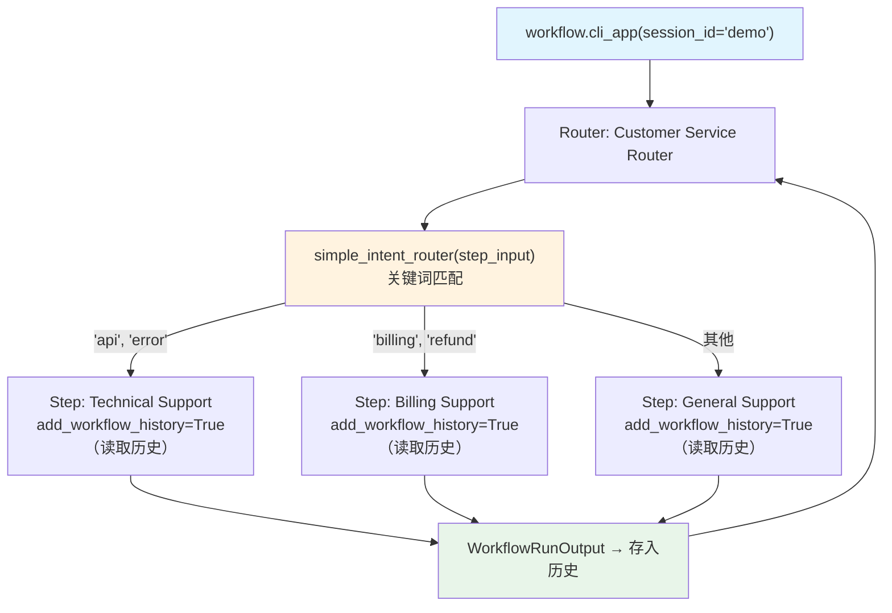

# intent_routing_with_history.py — 实现原理分析

> 源文件：`cookbook/04_workflows/06_advanced_concepts/history/intent_routing_with_history.py`

## 概述

本示例展示 Agno Workflow **`Router` + 步骤级历史注入**组合模式：基于关键词路由将用户请求动态分发到技术支持、账单支持或通用支持专员，每个专员步骤配置 `add_workflow_history=True` 使其能感知完整的历史对话，实现跨 router 分支的上下文连续性客服系统。

**核心配置一览：**

| 配置项 | 值 | 说明 |
|--------|------|------|
| `Step.add_workflow_history=True` | 所有专员步骤 | 每步都能读取历史 |
| `Workflow.add_workflow_history_to_steps=True` | Workflow 级 | 全局开启历史注入 |
| `Router.selector` | `simple_intent_router` | 关键词匹配路由 |
| `Workflow.cli_app()` | 交互式 CLI | 多轮对话模式 |

## 核心组件解析

### 历史感知专员步骤

```python
tech_support_step = Step(
    name="Technical Support",
    agent=tech_support_agent,
    add_workflow_history=True,  # 此步骤可读取历史
)

billing_support_step = Step(
    name="Billing Support",
    agent=billing_agent,
    add_workflow_history=True,
)

general_support_step = Step(
    name="General Support",
    agent=general_support_agent,
    add_workflow_history=True,
)
```

### 关键词路由函数

```python
def simple_intent_router(step_input: StepInput) -> List[Step]:
    message = step_input.input.lower()

    tech_keywords = ["api", "error", "bug", "technical", "login", "not working"]
    billing_keywords = ["billing", "payment", "refund", "charge", "subscription"]

    if any(k in message for k in tech_keywords):
        return [tech_support_step]
    if any(k in message for k in billing_keywords):
        return [billing_support_step]
    return [general_support_step]
```

### 历史注入 + Router 组合

```python
workflow = Workflow(
    db=SqliteDb(db_file="tmp/smart_customer_service.db"),
    steps=[
        Router(
            name="Customer Service Router",
            selector=simple_intent_router,
            choices=[tech_support_step, billing_support_step, general_support_step],
        )
    ],
    add_workflow_history_to_steps=True,  # 全局开启历史
)

workflow.cli_app(session_id="demo", stream=True, show_step_details=True)
```

## 历史连续性效果

```
第 1 轮: "My API is not working" → 路由到 tech_support（无历史）
第 2 轮: "I was also charged twice" → 路由到 billing_support（有第 1 轮历史：知道 API 问题）
第 3 轮: "Can you summarize what we discussed?" → 路由到 general_support（有全部历史）
```

## Mermaid 流程图



## 关键源码文件索引

| 文件 | 关键类/函数 | 作用 |
|------|------------|------|
| `agno/workflow/step.py` | `Step.add_workflow_history` | 步骤级历史注入控制 |
| `agno/workflow/workflow.py` | `Workflow.cli_app()` | 交互式 CLI 模式 |
| `agno/workflow/router.py` | `Router.selector` | 关键词路由选择 |
