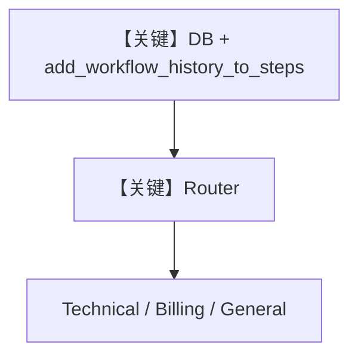

# intent_routing_with_history.py — 实现原理分析

<!-- cookbook-py-source:start -->
## 完整源码

```python
"""
Intent Routing With History
===========================

Demonstrates simple intent routing where all specialist steps share workflow history for context continuity.
"""

from typing import List

from agno.agent import Agent
from agno.db.sqlite import SqliteDb
from agno.models.openai import OpenAIChat
from agno.workflow.router import Router
from agno.workflow.step import Step
from agno.workflow.types import StepInput
from agno.workflow.workflow import Workflow

# ---------------------------------------------------------------------------
# Create Agents
# ---------------------------------------------------------------------------
tech_support_agent = Agent(
    name="Technical Support Specialist",
    model=OpenAIChat(id="gpt-4o"),
    instructions=[
        "You are a technical support specialist with deep product knowledge.",
        "You have access to the full conversation history with this customer.",
        "Reference previous interactions to provide better help.",
        "Build on any troubleshooting steps already attempted.",
        "Be patient and provide step-by-step technical guidance.",
    ],
)

billing_agent = Agent(
    name="Billing & Account Specialist",
    model=OpenAIChat(id="gpt-4o"),
    instructions=[
        "You are a billing and account specialist.",
        "You have access to the full conversation history with this customer.",
        "Reference any account details or billing issues mentioned previously.",
        "Build on any payment or account information already discussed.",
        "Be helpful with billing questions, refunds, and account changes.",
    ],
)

general_support_agent = Agent(
    name="General Customer Support",
    model=OpenAIChat(id="gpt-4o"),
    instructions=[
        "You are a general customer support representative.",
        "You have access to the full conversation history with this customer.",
        "Handle general inquiries, product information, and basic support.",
        "Reference the conversation context - build on what was discussed.",
        "Be friendly and acknowledge their previous interactions.",
    ],
)

# ---------------------------------------------------------------------------
# Define Steps
# ---------------------------------------------------------------------------
tech_support_step = Step(
    name="Technical Support",
    agent=tech_support_agent,
    add_workflow_history=True,
)

billing_support_step = Step(
    name="Billing Support",
    agent=billing_agent,
    add_workflow_history=True,
)

general_support_step = Step(
    name="General Support",
    agent=general_support_agent,
    add_workflow_history=True,
)


# ---------------------------------------------------------------------------
# Define Router
# ---------------------------------------------------------------------------
def simple_intent_router(step_input: StepInput) -> List[Step]:
    current_message = step_input.input or ""
    current_message_lower = current_message.lower()

    tech_keywords = [
        "api",
        "error",
        "bug",
        "technical",
        "login",
        "not working",
        "broken",
        "crash",
    ]
    billing_keywords = [
        "billing",
        "payment",
        "refund",
        "charge",
        "subscription",
        "invoice",
        "plan",
    ]

    if any(keyword in current_message_lower for keyword in tech_keywords):
        print("Routing to Technical Support")
        return [tech_support_step]
    if any(keyword in current_message_lower for keyword in billing_keywords):
        print("Routing to Billing Support")
        return [billing_support_step]

    print("Routing to General Support")
    return [general_support_step]


# ---------------------------------------------------------------------------
# Create Workflow
# ---------------------------------------------------------------------------
def create_smart_customer_service_workflow() -> Workflow:
    return Workflow(
        name="Smart Customer Service",
        description="Simple routing to specialists with shared conversation history",
        db=SqliteDb(db_file="tmp/smart_customer_service.db"),
        steps=[
            Router(
                name="Customer Service Router",
                selector=simple_intent_router,
                choices=[tech_support_step, billing_support_step, general_support_step],
                description="Routes to appropriate specialist based on simple intent detection",
            )
        ],
        add_workflow_history_to_steps=True,
    )


# ---------------------------------------------------------------------------
# Run Workflow
# ---------------------------------------------------------------------------
def demo_smart_customer_service_cli() -> None:
    workflow = create_smart_customer_service_workflow()

    print("Smart Customer Service Demo")
    print("=" * 60)
    print("")
    print("This workflow demonstrates:")
    print("- Simple routing between Technical, Billing, and General support")
    print("- Shared conversation history across all agents")
    print("- Context continuity - agents remember your entire conversation")
    print("")
    print("TRY THESE CONVERSATIONS:")
    print("")
    print("TECHNICAL SUPPORT:")
    print("   - 'My API is not working'")
    print("   - 'I'm getting an error message'")
    print("   - 'There's a technical bug'")
    print("")
    print("BILLING SUPPORT:")
    print("   - 'I need help with billing'")
    print("   - 'Can I get a refund?'")
    print("   - 'My payment was charged twice'")
    print("")
    print("GENERAL SUPPORT:")
    print("   - 'Hello, I have a question'")
    print("   - 'What features do you offer?'")
    print("   - 'I need general help'")
    print("")
    print("Type 'exit' to quit")
    print("-" * 60)

    workflow.cli_app(
        session_id="smart_customer_service_demo",
        user="Customer",
        emoji="",
        stream=True,
        show_step_details=True,
    )


if __name__ == "__main__":
    demo_smart_customer_service_cli()
```

<!-- cookbook-py-source:end -->

> 源文件：`cookbook/04_workflows/06_advanced_concepts/history/intent_routing_with_history.py`

## 概述

本示例展示 **`Router` + `add_workflow_history_to_steps=True`**：顶层工作流把多轮会话历史注入各专家 Step；每个 `Step` 另设 **`add_workflow_history=True`**（`L63-70`），保证路由到的客服 Agent 能读全量对话。`simple_intent_router` 按关键词返回单步列表。

**核心配置一览：**

| 配置项 | 值 | 说明 |
|--------|------|------|
| `create_smart_customer_service_workflow` | `Router` 单步 | `L120-134` |
| `add_workflow_history_to_steps` | `True` | Workflow 级 |
| `tech_support_step.add_workflow_history` | `True` | Step 级 |
| `db` | `tmp/smart_customer_service.db` | 持久化 |
| `selector` | `simple_intent_router` | `L82-114` |

## 架构分层

```
cli_app 多轮 ──> SqliteDb ──> Router ──> 单一 Specialist Step
                      │
                      └── 历史注入 Agent 消息
```

## 核心组件解析

### simple_intent_router

技术词 → `[tech_support_step]`；账单词 → billing；否则 general（`L106-114`）。

### 运行机制与因果链

1. **数据路径**：同 `session_id` 下多轮用户消息累积 → 任一分支 Agent 均见完整历史。
2. **与仅 Workflow 级 history 差异**：Step 显式 `add_workflow_history=True` 用于细粒度控制（与 `step_history.py` 中 content 管线对照）。

## System Prompt 组装

三专家 instructions 均为多行列表（`L24-54`），均强调 **full conversation history**。

### 还原后的完整 System 文本（Technical Support 节选）

```text
You are a technical support specialist with deep product knowledge.
You have access to the full conversation history with this customer.
Reference previous interactions to provide better help.
Build on any troubleshooting steps already attempted.
Be patient and provide step-by-step technical guidance.
```

## 完整 API 请求

`gpt-4o` Chat Completions；`messages` 含历史拼接。

## Mermaid 流程图


```mermaid
flowchart TD
    H["【关键】DB + add_workflow_history_to_steps"] --> R["【关键】Router"]
    R --> T["Technical / Billing / General"]
```

## 关键源码文件索引

| 文件 | 作用 |
|------|------|
| `agno/workflow/router.py` | `Router` L44 |
| `agno/workflow/workflow.py` | `add_workflow_history_to_steps` L274 |
