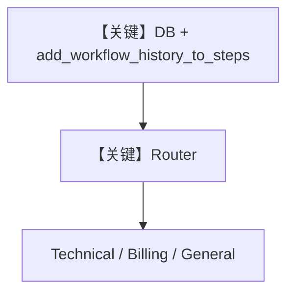

# intent_routing_with_history.py — 实现原理分析

> 源文件：`cookbook/04_workflows/06_advanced_concepts/history/intent_routing_with_history.py`

## 概述

本示例展示 **`Router` + `add_workflow_history_to_steps=True`**：顶层工作流把多轮会话历史注入各专家 Step；每个 `Step` 另设 **`add_workflow_history=True`**（`L63-70`），保证路由到的客服 Agent 能读全量对话。`simple_intent_router` 按关键词返回单步列表。

**核心配置一览：**

| 配置项 | 值 | 说明 |
|--------|------|------|
| `create_smart_customer_service_workflow` | `Router` 单步 | `L120-134` |
| `add_workflow_history_to_steps` | `True` | Workflow 级 |
| `tech_support_step.add_workflow_history` | `True` | Step 级 |
| `db` | `tmp/smart_customer_service.db` | 持久化 |
| `selector` | `simple_intent_router` | `L82-114` |

## 架构分层

```
cli_app 多轮 ──> SqliteDb ──> Router ──> 单一 Specialist Step
                      │
                      └── 历史注入 Agent 消息
```

## 核心组件解析

### simple_intent_router

技术词 → `[tech_support_step]`；账单词 → billing；否则 general（`L106-114`）。

### 运行机制与因果链

1. **数据路径**：同 `session_id` 下多轮用户消息累积 → 任一分支 Agent 均见完整历史。
2. **与仅 Workflow 级 history 差异**：Step 显式 `add_workflow_history=True` 用于细粒度控制（与 `step_history.py` 中 content 管线对照）。

## System Prompt 组装

三专家 instructions 均为多行列表（`L24-54`），均强调 **full conversation history**。

### 还原后的完整 System 文本（Technical Support 节选）

```text
You are a technical support specialist with deep product knowledge.
You have access to the full conversation history with this customer.
Reference previous interactions to provide better help.
Build on any troubleshooting steps already attempted.
Be patient and provide step-by-step technical guidance.
```

## 完整 API 请求

`gpt-4o` Chat Completions；`messages` 含历史拼接。

## Mermaid 流程图


```mermaid
flowchart TD
    H["【关键】DB + add_workflow_history_to_steps"] --> R["【关键】Router"]
    R --> T["Technical / Billing / General"]
```

## 关键源码文件索引

| 文件 | 作用 |
|------|------|
| `agno/workflow/router.py` | `Router` L44 |
| `agno/workflow/workflow.py` | `add_workflow_history_to_steps` L274 |
