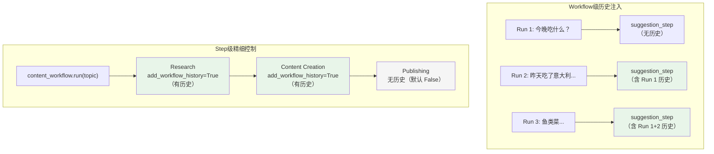

# step_history.py — 实现原理分析

> 源文件：`cookbook/04_workflows/06_advanced_concepts/history/step_history.py`

## 概述

本示例展示 Agno Workflow **两种历史注入控制粒度**：`Workflow(add_workflow_history_to_steps=True)` 将对话历史注入到所有步骤，而 `Step(add_workflow_history=True)` 允许对特定步骤单独控制，未标记的步骤不会接收历史上下文。

**核心配置一览：**

| 控制方式 | 作用域 | 适用场景 |
|---------|-------|---------|
| `Workflow(add_workflow_history_to_steps=True)` | 所有步骤 | 全局对话感知 |
| `Step(add_workflow_history=True)` | 单个步骤 | 精细化历史控制 |
| `Step(add_workflow_history=False)` | 单个步骤（默认） | 步骤无历史感知 |

## 核心组件解析

### Workflow 级全局历史注入

```python
meal_workflow = Workflow(
    name="Conversational Meal Planner",
    db=SqliteDb(db_file="tmp/meal_workflow.db"),
    steps=[suggestion_step, preference_analysis_step, recipe_step],
    add_workflow_history_to_steps=True,   # 所有步骤均获得历史上下文
)
```

**效果**：`suggestion_step`、`preference_analysis_step`、`recipe_step` 都能读取之前 run 的完整对话历史，实现跨 run 的上下文感知（如"我之前说过不吃意大利菜"）。

### Step 级精细历史控制

```python
content_workflow = Workflow(
    db=SqliteDb(db_file="tmp/content_workflow.db"),
    steps=[
        Step(name="Research Phase", agent=research_agent, add_workflow_history=True),   # 有历史
        Step(name="Content Creation", agent=content_creator, add_workflow_history=True), # 有历史
        Step(name="Content Publishing", agent=publisher_agent),  # 无历史（默认 False）
    ],
    # 注：Workflow 级未设置 add_workflow_history_to_steps
)
```

**效果**：Research 和 Content Creation 步骤能感知历史（避免重复内容），而 Publishing 步骤只处理当前 run 的内容。

### 对话式多轮调用

```python
session_id = "meal_planning_demo"
# 第一轮
meal_workflow.print_response(input="今晚吃什么？", session_id=session_id)
# 第二轮（历史感知：知道用户昨天吃了意大利菜）
meal_workflow.print_response(input="我昨天吃了意大利菜，想吃健康点的", session_id=session_id)
# 第三轮（历史感知：知道偏好和约束）
meal_workflow.print_response(input="有没有鱼类菜？我喜欢亚洲风味", session_id=session_id)
```

## Mermaid 流程图



## 关键源码文件索引

| 文件 | 关键类/函数 | 作用 |
|------|------------|------|
| `agno/workflow/workflow.py` | `Workflow.add_workflow_history_to_steps` | 全局历史注入开关 |
| `agno/workflow/step.py` | `Step.add_workflow_history` | 步骤级历史注入控制 |
| `agno/db/sqlite.py` | `SqliteDb` | 持久化对话历史 |
