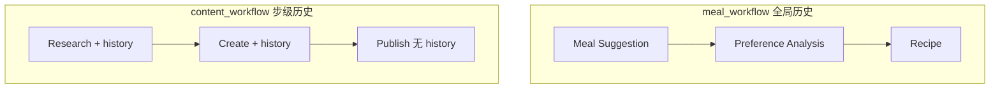

# step_history.py — 实现原理分析

> 源文件：`cookbook/04_workflows/06_advanced_concepts/history/step_history.py`

## 概述

本示例对比 **工作流级历史** 与 **步骤级历史**：`meal_workflow` 使用 `add_workflow_history_to_steps=True` 覆盖全部步；`content_workflow` 仅在部分 `Step` 上设置 `add_workflow_history=True`（研究、创作），发布步关闭，演示「只有指定步看得到历史」。

**核心配置一览：**

| Workflow | 历史策略 |
|----------|----------|
| `meal_workflow` | 全局 `add_workflow_history_to_steps=True`（`L123-128`） |
| `content_workflow` | `Step(..., add_workflow_history=True)` 仅前两步（`L178-186`） |
| `analyze_food_preferences` | 函数步，读 `previous_step_content`（`L44-108`） |

## 核心组件解析

### analyze_food_preferences

基于 `current_request` 与 `previous_step_content` 启发式抽取饮食偏好，输出指导文本给 `recipe_specialist`。

### 运行机制与因果链

1. **meal 演示**：三次 `print_response` 同 `session_id` 模拟多轮（`L193-218`）。
2. **content 演示**：`cli_app` 展示步级历史（`L221-237`）。

## System Prompt 组装

`meal_suggester` / `recipe_specialist` / `research_agent` / `content_creator` / `publisher_agent` 均有长 instructions；须从源文件 `L20-37`、`L146-172` 原样还原。

### 还原后的完整 System 文本（meal_suggester）

```text
You are a friendly meal planning assistant who suggests meal categories and cuisines.
Consider the time of day, day of the week, and any context from the conversation.
Keep suggestions broad (Italian, Asian, healthy, comfort food, quick meals, etc.)
Ask follow-up questions to understand preferences better.
```

## 完整 API 请求

各 `OpenAIChat(gpt-4o)` Chat Completions；历史进入 `messages` 由框架拼接。

## Mermaid 流程图


```mermaid
flowchart TD
    subgraph Meal["meal_workflow 全局历史"]
        M1["Meal Suggestion"] --> M2["Preference Analysis"]
        M2 --> M3["Recipe"]
    end
    subgraph Content["content_workflow 步级历史"]
        C1["Research + history"] --> C2["Create + history"]
        C2 --> C3["Publish 无 history"]
    end
```

## 关键源码文件索引

| 文件 | 作用 |
|------|------|
| `agno/workflow/workflow.py` | Workflow 级 history 开关 |
| `agno/workflow/step.py` | Step 级 `add_workflow_history` |
