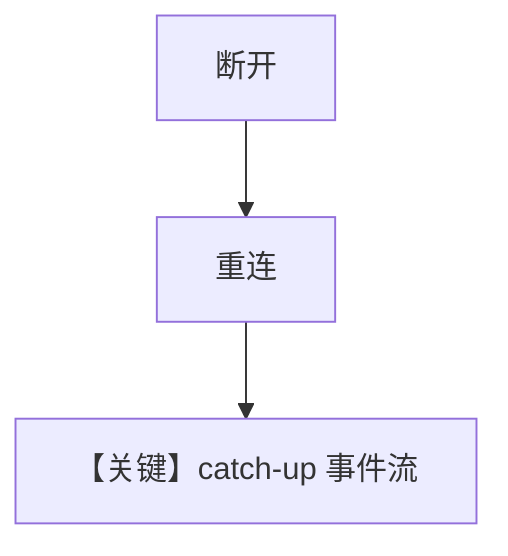

# disruption_catchup.py — 实现原理分析

> 源文件：`cookbook/04_workflows/06_advanced_concepts/long_running/disruption_catchup.py`

## 概述

本示例验证 **断线重连后 `last_event_index=None` 的「全量追平」**：客户端在 WebSocket/流中断后重新订阅，服务端重放或快进事件以使客户端状态与运行一致（测试向脚本，依赖外部服务）。

**核心配置一览：**

| 配置项 | 说明 |
|--------|------|
| 异步 `asyncio` | 模拟网络 |
| `last_event_index` | `None` 表全量 catch-up |

## 运行机制与因果链

与 `events_replay`、`websocket_reconnect` 同属长连接可靠性验证，非教学用最小 Workflow。

## System Prompt 组装

通常无内嵌 Agent；若连接真实 workflow，system 在服务端。

## Mermaid 流程图

## 关键源码文件索引

| 文件 | 作用 |
|------|------|
| `agno/workflow/workflow.py` | 事件序号与存储 |
