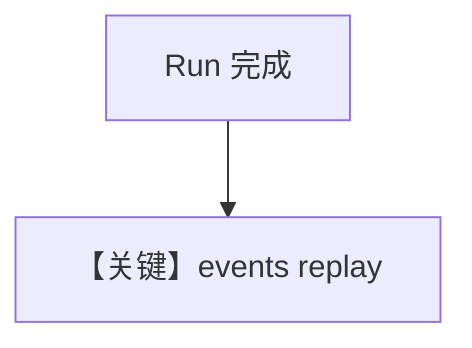

# events_replay.py — 实现原理分析

> 源文件：`cookbook/04_workflows/06_advanced_concepts/long_running/events_replay.py`

## 概述

本示例验证 **已完成后重连的事件重放行为**：客户端在 run 结束后再次订阅，应收到完成态或完整事件日志（用于 SDK 一致性测试）。

## 核心组件解析

依赖异步 WebSocket/HTTP 客户端与存储的事件序列；与生产 `store_events` 配置相关。

## System Prompt 组装

无单一 Agent 示例时可注明不适用。

## Mermaid 流程图

## 关键源码文件索引

| 文件 | 作用 |
|------|------|
| `agno/workflow/workflow.py` | 事件持久化 |
