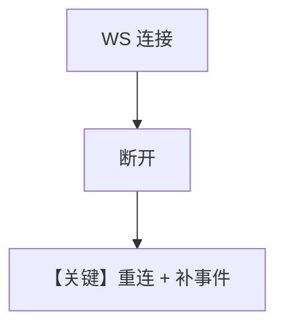

# websocket_reconnect.py — 实现原理分析

> 源文件：`cookbook/04_workflows/06_advanced_concepts/long_running/websocket_reconnect.py`

## 概述

本示例验证 **WebSocket 订阅 → 断开 → 重连 → 丢失事件追平** 全流程，确保客户端 UI 与后台 run 状态一致。

## 运行机制与因果链

重连后结合 `last_event_index` 或全量 catch-up；与 `disruption_catchup` 形成测试矩阵。

## Mermaid 流程图

## 关键源码文件索引

| 文件 | 作用 |
|------|------|
| `agno/os` WebSocket 处理 | 事件推送 |
