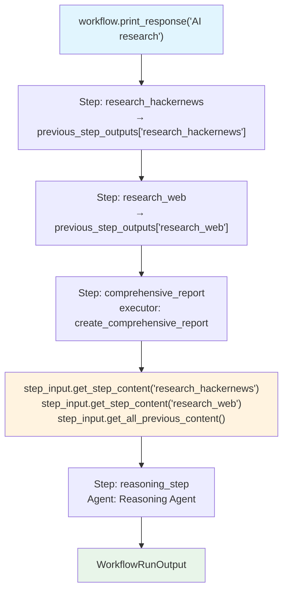

# access_previous_outputs.py — 实现原理分析

> 源文件：`cookbook/04_workflows/06_advanced_concepts/previous_step_outputs/access_previous_outputs.py`

## 概述

本示例展示 Agno Workflow **`StepInput` 中访问多个前驱步骤输出**的两种机制：通过 `step_input.get_step_content("step_name")` 按步骤名访问（需步骤有 `name`），以及通过 `step_input.get_step_content("step_N")` 按隐式索引键访问（匿名步骤）。

**核心配置一览：**

| 访问方式 | API | 适用场景 |
|---------|-----|---------|
| 按步骤名 | `step_input.get_step_content("research_hackernews")` | Step 有 `name` 属性 |
| 按隐式索引 | `step_input.get_step_content("step_1")` | Step 无名称（`step_N`，从 1 开始） |
| 获取全部 | `step_input.get_all_previous_content()` | 合并所有前驱输出 |
| 原始字典 | `step_input.previous_step_outputs` | `Dict[str, StepOutput]` 完整数据 |

## 核心组件解析

### 按名称访问（Named Steps）

```python
research_hackernews = Step(name="research_hackernews", agent=hackernews_agent)
research_web = Step(name="research_web", agent=web_agent)

def create_comprehensive_report(step_input: StepInput) -> StepOutput:
    hackernews_data = step_input.get_step_content("research_hackernews")  # 按名访问
    web_data = step_input.get_step_content("research_web")                # 按名访问
    all_content = step_input.get_all_previous_content()                   # 全部合并
```

### 按隐式索引访问（Anonymous Steps）

```python
# 匿名步骤直接传 Agent/函数（无 name）
direct_steps_workflow = Workflow(
    steps=[
        anonymous_hackernews_agent,   # → "step_1"
        anonymous_web_agent,          # → "step_2"
        create_report_fn,             # → "step_3"
    ],
)

def create_comprehensive_report_from_step_indices(step_input: StepInput) -> StepOutput:
    hackernews_data = step_input.get_step_content("step_1")  # 按隐式索引
    web_data = step_input.get_step_content("step_2")
```

### previous_step_outputs 原始字典

```python
if step_input.previous_step_outputs:
    for step_name, output in step_input.previous_step_outputs.items():
        print(f"- {step_name}: {len(str(output.content))} characters")
```

## 两种访问方式对比

| 特性 | 按名称 | 按索引 |
|------|-------|-------|
| Step 定义 | `Step(name="...")` | 直接传 Agent/函数 |
| 键格式 | `"step_name"` | `"step_1"`, `"step_2"`, ... |
| 可读性 | 高 | 低（需记住顺序） |
| 重构安全性 | 高（名称不变则稳定） | 低（顺序变化则 key 改变） |

## Mermaid 流程图



## 关键源码文件索引

| 文件 | 关键类/函数 | 作用 |
|------|------------|------|
| `agno/workflow/types.py` | `StepInput.previous_step_outputs` | `Dict[str, StepOutput]` |
| `agno/workflow/types.py` | `StepInput.get_step_content()` | 按名/索引查询前驱内容 |
| `agno/workflow/types.py` | `StepInput.get_all_previous_content()` | 合并所有前驱输出 |
