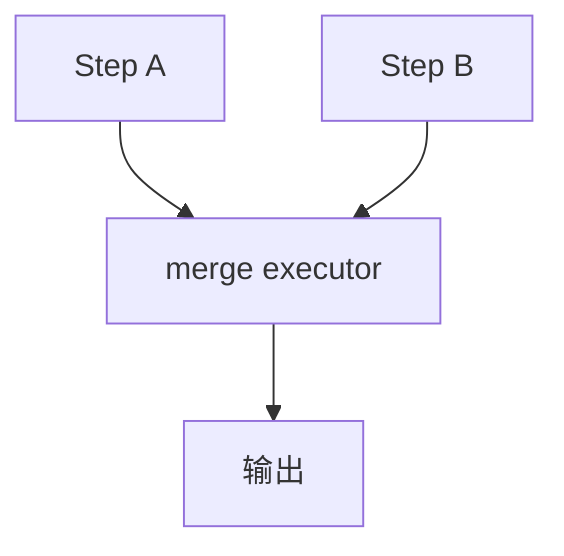

# access_previous_outputs.py — 实现原理分析

> 源文件：`cookbook/04_workflows/06_advanced_concepts/previous_step_outputs/access_previous_outputs.py`

## 概述

本示例展示在 **函数 Step** 中通过 **`StepInput`** 访问**多个前序具名步骤**的输出（`previous_step_outputs` 映射或等价 API），用于聚合多路研究再生成综合答案。

**核心配置一览：**

| 配置项 | 说明 |
|--------|------|
| 多 `Step` | 各命名以便映射键 |
| `executor` | 读取多前序 content |

## 运行机制与因果链

与 CEL `previous_step_outputs` 同源数据：Python 侧可直接用 `step_input` 上的访问器（见 `types.py`）。

## System Prompt 组装

聚合步若为 Agent，instructions 见源文件；函数步无 LLM。

## Mermaid 流程图

```mermaid
flowchart TD
    A["Step A"] --> M["merge executor"]
    B["Step B"] --> M
    M --> O["输出"]
```

## 关键源码文件索引

| 文件 | 作用 |
|------|------|
| `agno/workflow/types.py` | `StepInput` 前序输出访问 |
