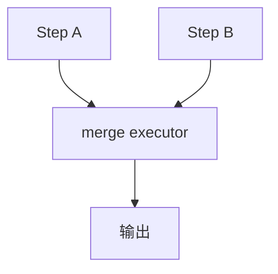

# access_previous_outputs.py — 实现原理分析

<!-- cookbook-py-source:start -->
## 完整源码

```python
"""
Access Previous Outputs
=======================

Demonstrates accessing output from multiple prior steps using both named steps and implicit step keys.
"""

from agno.agent.agent import Agent
from agno.tools.hackernews import HackerNewsTools
from agno.tools.websearch import WebSearchTools
from agno.workflow.step import Step
from agno.workflow.types import StepInput, StepOutput
from agno.workflow.workflow import Workflow

# ---------------------------------------------------------------------------
# Create Agents
# ---------------------------------------------------------------------------
hackernews_agent = Agent(
    name="HackerNews Researcher",
    instructions="You are a researcher specializing in finding the latest tech news and discussions from Hacker News. Focus on startup trends, programming topics, and tech industry insights.",
    tools=[HackerNewsTools()],
)

web_agent = Agent(
    name="Web Researcher",
    instructions="You are a comprehensive web researcher. Search across multiple sources including news sites, blogs, and official documentation to gather detailed information.",
    tools=[WebSearchTools()],
)

reasoning_agent = Agent(
    name="Reasoning Agent",
    instructions="You are an expert analyst who creates comprehensive reports by analyzing and synthesizing information from multiple sources. Create well-structured, insightful reports.",
)

anonymous_hackernews_agent = Agent(
    instructions="You are a researcher specializing in finding the latest tech news and discussions from Hacker News. Focus on startup trends, programming topics, and tech industry insights.",
    tools=[HackerNewsTools()],
)

anonymous_web_agent = Agent(
    instructions="You are a comprehensive web researcher. Search across multiple sources including news sites, blogs, and official documentation to gather detailed information.",
    tools=[WebSearchTools()],
)

anonymous_reasoning_agent = Agent(
    instructions="You are an expert analyst who creates comprehensive reports by analyzing and synthesizing information from multiple sources. Create well-structured, insightful reports.",
)

# ---------------------------------------------------------------------------
# Define Steps For Named Access
# ---------------------------------------------------------------------------
research_hackernews = Step(
    name="research_hackernews",
    agent=hackernews_agent,
    description="Research latest tech trends from Hacker News",
)

research_web = Step(
    name="research_web",
    agent=web_agent,
    description="Comprehensive web research on the topic",
)


def create_comprehensive_report(step_input: StepInput) -> StepOutput:
    original_topic = step_input.input or ""
    hackernews_data = step_input.get_step_content("research_hackernews") or ""
    web_data = step_input.get_step_content("research_web") or ""
    _ = step_input.get_all_previous_content()

    report = f"""
        # Comprehensive Research Report: {original_topic}

        ## Executive Summary
        Based on research from HackerNews and web sources, here's a comprehensive analysis of {original_topic}.

        ## HackerNews Insights
        {hackernews_data[:500]}...

        ## Web Research Findings
        {web_data[:500]}...
    """

    return StepOutput(
        step_name="comprehensive_report", content=report.strip(), success=True
    )


comprehensive_report_step = Step(
    name="comprehensive_report",
    executor=create_comprehensive_report,
    description="Create comprehensive report from all research sources",
)

reasoning_step = Step(
    name="final_reasoning",
    agent=reasoning_agent,
    description="Apply reasoning to create final insights and recommendations",
)


# ---------------------------------------------------------------------------
# Define Functions For Implicit Step-Key Access
# ---------------------------------------------------------------------------
def create_comprehensive_report_from_step_indices(step_input: StepInput) -> StepOutput:
    original_topic = step_input.input or ""
    hackernews_data = step_input.get_step_content("step_1") or ""
    web_data = step_input.get_step_content("step_2") or ""
    _ = step_input.get_all_previous_content()

    report = f"""
        # Comprehensive Research Report: {original_topic}

        ## Executive Summary
        Based on research from HackerNews and web sources, here's a comprehensive analysis of {original_topic}.

        ## HackerNews Insights
        {hackernews_data[:500]}...

        ## Web Research Findings
        {web_data[:500]}...
    """

    return StepOutput(content=report.strip(), success=True)


def print_final_report(step_input: StepInput) -> StepOutput:
    comprehensive_report = step_input.get_step_content("create_comprehensive_report")

    print("=" * 80)
    print("FINAL COMPREHENSIVE REPORT")
    print("=" * 80)
    print(comprehensive_report)
    print("=" * 80)

    print("\nDEBUG: All previous step outputs:")
    if step_input.previous_step_outputs:
        for step_name, output in step_input.previous_step_outputs.items():
            print(f"- {step_name}: {len(str(output.content))} characters")

    return StepOutput(
        step_name="print_final_report",
        content=f"Printed comprehensive report ({len(comprehensive_report)} characters)",
        success=True,
    )


# ---------------------------------------------------------------------------
# Create Workflows
# ---------------------------------------------------------------------------
workflow = Workflow(
    name="Enhanced Research Workflow",
    description="Multi-source research with custom data flow and reasoning",
    steps=[
        research_hackernews,
        research_web,
        comprehensive_report_step,
        reasoning_step,
    ],
)

direct_steps_workflow = Workflow(
    name="Enhanced Research Workflow",
    description="Multi-source research with custom data flow and reasoning",
    steps=[
        anonymous_hackernews_agent,
        anonymous_web_agent,
        create_comprehensive_report_from_step_indices,
        print_final_report,
    ],
)

# ---------------------------------------------------------------------------
# Run Workflows
# ---------------------------------------------------------------------------
if __name__ == "__main__":
    workflow.print_response(
        "Latest developments in artificial intelligence and machine learning",
        markdown=True,
        stream=True,
    )

    direct_steps_workflow.print_response(
        "Latest developments in artificial intelligence and machine learning",
    )
```

<!-- cookbook-py-source:end -->

> 源文件：`cookbook/04_workflows/06_advanced_concepts/previous_step_outputs/access_previous_outputs.py`

## 概述

本示例展示在 **函数 Step** 中通过 **`StepInput`** 访问**多个前序具名步骤**的输出（`previous_step_outputs` 映射或等价 API），用于聚合多路研究再生成综合答案。

**核心配置一览：**

| 配置项 | 说明 |
|--------|------|
| 多 `Step` | 各命名以便映射键 |
| `executor` | 读取多前序 content |

## 运行机制与因果链

与 CEL `previous_step_outputs` 同源数据：Python 侧可直接用 `step_input` 上的访问器（见 `types.py`）。

## System Prompt 组装

聚合步若为 Agent，instructions 见源文件；函数步无 LLM。

## Mermaid 流程图


```mermaid
flowchart TD
    A["Step A"] --> M["merge executor"]
    B["Step B"] --> M
    M --> O["输出"]
```

## 关键源码文件索引

| 文件 | 作用 |
|------|------|
| `agno/workflow/types.py` | `StepInput` 前序输出访问 |
