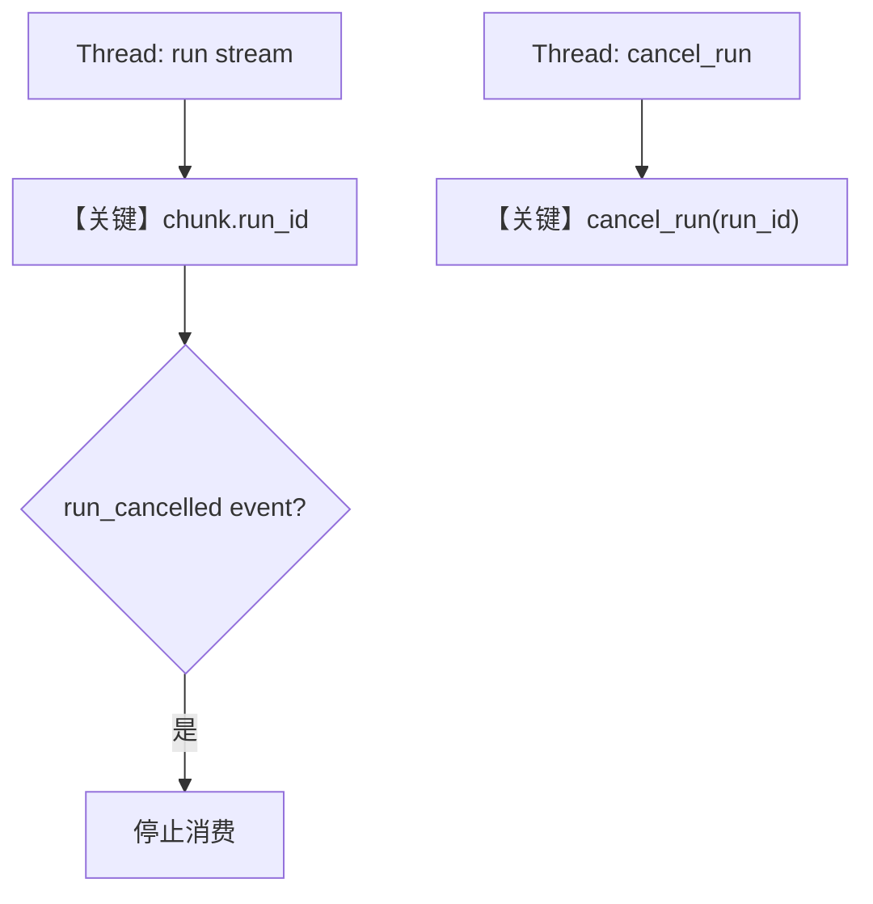

# cancel_run.py — 实现原理分析

<!-- cookbook-py-source:start -->
## 完整源码

```python
"""
Cancel Run
==========

Demonstrates starting a workflow run in one thread and cancelling it from another.
"""

import threading
import time

from agno.agent import Agent
from agno.models.openai import OpenAIChat
from agno.run.agent import RunEvent
from agno.run.base import RunStatus
from agno.run.workflow import WorkflowRunEvent
from agno.tools.websearch import WebSearchTools
from agno.workflow.step import Step
from agno.workflow.workflow import Workflow


# ---------------------------------------------------------------------------
# Define Helpers
# ---------------------------------------------------------------------------
def long_running_task(workflow: Workflow, run_id_container: dict) -> None:
    try:
        final_response = None
        content_pieces = []

        for chunk in workflow.run(
            "Write a very long story about a dragon who learns to code. "
            "Make it at least 2000 words with detailed descriptions and dialogue. "
            "Take your time and be very thorough.",
            stream=True,
        ):
            if "run_id" not in run_id_container and chunk.run_id:
                print(f"[START] Workflow run started: {chunk.run_id}")
                run_id_container["run_id"] = chunk.run_id

            if chunk.event in [RunEvent.run_content]:
                print(chunk.content, end="", flush=True)
                content_pieces.append(chunk.content)
            elif chunk.event == RunEvent.run_cancelled:
                print(f"\n[CANCELLED] Workflow run was cancelled: {chunk.run_id}")
                run_id_container["result"] = {
                    "status": "cancelled",
                    "run_id": chunk.run_id,
                    "cancelled": True,
                    "content": "".join(content_pieces)[:200] + "..."
                    if content_pieces
                    else "No content before cancellation",
                }
                return
            elif chunk.event == WorkflowRunEvent.workflow_cancelled:
                print(f"\n[CANCELLED] Workflow run was cancelled: {chunk.run_id}")
                run_id_container["result"] = {
                    "status": "cancelled",
                    "run_id": chunk.run_id,
                    "cancelled": True,
                    "content": "".join(content_pieces)[:200] + "..."
                    if content_pieces
                    else "No content before cancellation",
                }
                return
            elif hasattr(chunk, "status") and chunk.status == RunStatus.completed:
                final_response = chunk

        if final_response:
            run_id_container["result"] = {
                "status": final_response.status.value
                if final_response.status
                else "completed",
                "run_id": final_response.run_id,
                "cancelled": final_response.status == RunStatus.cancelled,
                "content": ("".join(content_pieces)[:200] + "...")
                if content_pieces
                else "No content",
            }
        else:
            run_id_container["result"] = {
                "status": "unknown",
                "run_id": run_id_container.get("run_id"),
                "cancelled": False,
                "content": ("".join(content_pieces)[:200] + "...")
                if content_pieces
                else "No content",
            }

    except Exception as e:
        print(f"\n[ERROR] Exception in run: {str(e)}")
        run_id_container["result"] = {
            "status": "error",
            "error": str(e),
            "run_id": run_id_container.get("run_id"),
            "cancelled": True,
            "content": "Error occurred",
        }


def cancel_after_delay(
    workflow: Workflow, run_id_container: dict, delay_seconds: int = 3
) -> None:
    print(f"[WAIT] Will cancel workflow run in {delay_seconds} seconds...")
    time.sleep(delay_seconds)

    run_id = run_id_container.get("run_id")
    if run_id:
        print(f"[CANCEL] Cancelling workflow run: {run_id}")
        success = workflow.cancel_run(run_id)
        if success:
            print(f"[OK] Workflow run {run_id} marked for cancellation")
        else:
            print(
                f"[ERROR] Failed to cancel workflow run {run_id} (may not exist or already completed)"
            )
    else:
        print("[WARN] No run_id found to cancel")


# ---------------------------------------------------------------------------
# Create Workflow
# ---------------------------------------------------------------------------
def main() -> None:
    researcher = Agent(
        name="Research Agent",
        model=OpenAIChat(id="gpt-4o-mini"),
        tools=[WebSearchTools()],
        instructions="Research the given topic and provide key facts and insights.",
    )

    writer = Agent(
        name="Writing Agent",
        model=OpenAIChat(id="gpt-4o"),
        instructions="Write a comprehensive article based on the research provided. Make it engaging and well-structured.",
    )

    research_step = Step(
        name="research",
        agent=researcher,
        description="Research the topic and gather information",
    )

    writing_step = Step(
        name="writing",
        agent=writer,
        description="Write an article based on the research",
    )

    article_workflow = Workflow(
        description="Automated article creation from research to writing",
        steps=[research_step, writing_step],
        debug_mode=True,
    )

    print("[START] Starting workflow run cancellation example...")
    print("=" * 50)

    run_id_container = {}

    workflow_thread = threading.Thread(
        target=lambda: long_running_task(article_workflow, run_id_container),
        name="WorkflowRunThread",
    )

    cancel_thread = threading.Thread(
        target=cancel_after_delay,
        args=(article_workflow, run_id_container, 8),
        name="CancelThread",
    )

    print("[RUN] Starting workflow run thread...")
    workflow_thread.start()

    print("[RUN] Starting cancellation thread...")
    cancel_thread.start()

    print("[WAIT] Waiting for threads to complete...")
    workflow_thread.join()
    cancel_thread.join()

    print("\n" + "=" * 50)
    print("RESULTS")
    print("=" * 50)

    result = run_id_container.get("result")
    if result:
        print(f"Status: {result['status']}")
        print(f"Run ID: {result['run_id']}")
        print(f"Was Cancelled: {result['cancelled']}")

        if result.get("error"):
            print(f"Error: {result['error']}")
        else:
            print(f"Content Preview: {result['content']}")

        if result["cancelled"]:
            print("\n[OK] SUCCESS: Workflow run was successfully cancelled")
        else:
            print("\n[WARN] Workflow run completed before cancellation")
    else:
        print(
            "[ERROR] No result obtained - check if cancellation happened during streaming"
        )

    print("\nWorkflow cancellation example completed")


# ---------------------------------------------------------------------------
# Run Workflow
# ---------------------------------------------------------------------------
if __name__ == "__main__":
    main()
```

<!-- cookbook-py-source:end -->

> 源文件：`cookbook/04_workflows/06_advanced_concepts/run_control/cancel_run.py`

## 概述

本示例展示 **流式 `workflow.run(..., stream=True)` 与跨线程 `workflow.cancel_run(run_id)`**：主线程消费 `WorkflowRunOutputEvent` 流，另一线程在延迟后调用 `cancel_run`；流中可出现 `RunEvent.run_cancelled` 或 `WorkflowRunEvent.workflow_cancelled`（`L42-62`）。`register_run` 在 `Workflow.run` 内部完成，使取消与运行 ID 关联（见 `workflow.py` `L6438-6439`）。

**核心配置一览：**

| 配置项 | 值 | 说明 |
|--------|------|------|
| `article_workflow.steps` | `research`, `writing` | 两步 Agent |
| `debug_mode` | `True` | `L151` |
| `researcher` | `gpt-4o-mini` + `WebSearchTools` | `L123-128` |
| `writer` | `gpt-4o` | `L130-134` |
| 取消延迟 | `cancel_after_delay(..., 8)` | `L166` |

## 架构分层

```
Thread A: workflow.run(stream=True) 迭代 chunk
Thread B: sleep → workflow.cancel_run(run_id)
         │
         └── agno.run.cancel 全局注册表与 Workflow 协作
```

## 核心组件解析

### long_running_task

`L24-96`：从首个 chunk 取 `run_id`；处理 `run_content` 拼接；遇取消事件写 `run_id_container["result"]`。

### cancel_after_delay

`L99-116`：调用 `workflow.cancel_run(run_id)`（`L108`），成功则标记取消。

### 运行机制与因果链

1. **数据路径**：用户长提示 → 流式 token → 取消信号 → 部分 content。
2. **状态**：`run_id` 在流中暴露；无 `db` 本例。

## System Prompt 组装

### 还原后的完整 System 文本（Research Agent）

```text
Research the given topic and provide key facts and insights.
```

### 还原后的完整 System 文本（Writing Agent）

```text
Write a comprehensive article based on the research provided. Make it engaging and well-structured.
```

## 完整 API 请求

流式 Chat Completions；取消时连接中断或内部协作停止生成（依适配器）。

## Mermaid 流程图



## 关键源码文件索引

| 文件 | 作用 |
|------|------|
| `agno/workflow/workflow.py` | `run` 内 `register_run` L6438；`cancel_run` 方法 |
| `agno/run/cancel.py` | 全局取消注册 |
