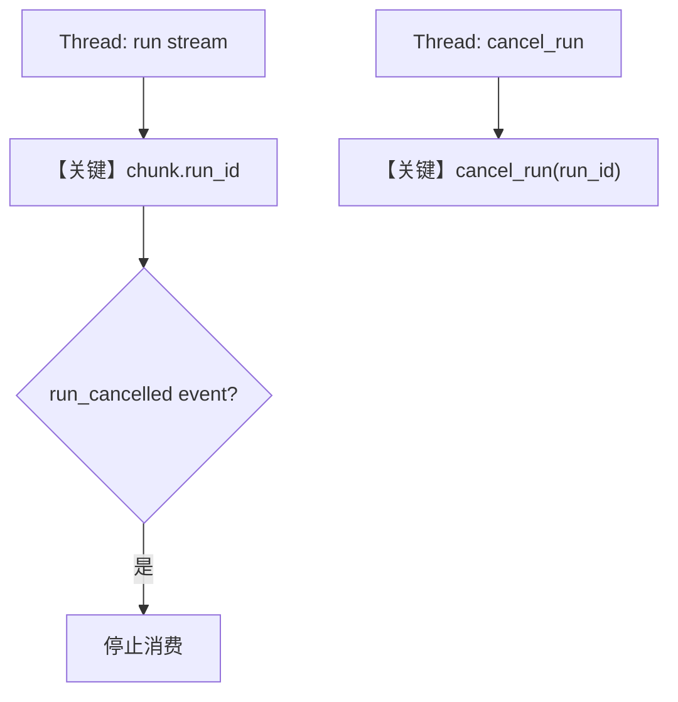

# cancel_run.py — 实现原理分析

> 源文件：`cookbook/04_workflows/06_advanced_concepts/run_control/cancel_run.py`

## 概述

本示例展示 **流式 `workflow.run(..., stream=True)` 与跨线程 `workflow.cancel_run(run_id)`**：主线程消费 `WorkflowRunOutputEvent` 流，另一线程在延迟后调用 `cancel_run`；流中可出现 `RunEvent.run_cancelled` 或 `WorkflowRunEvent.workflow_cancelled`（`L42-62`）。`register_run` 在 `Workflow.run` 内部完成，使取消与运行 ID 关联（见 `workflow.py` `L6438-6439`）。

**核心配置一览：**

| 配置项 | 值 | 说明 |
|--------|------|------|
| `article_workflow.steps` | `research`, `writing` | 两步 Agent |
| `debug_mode` | `True` | `L151` |
| `researcher` | `gpt-4o-mini` + `WebSearchTools` | `L123-128` |
| `writer` | `gpt-4o` | `L130-134` |
| 取消延迟 | `cancel_after_delay(..., 8)` | `L166` |

## 架构分层

```
Thread A: workflow.run(stream=True) 迭代 chunk
Thread B: sleep → workflow.cancel_run(run_id)
         │
         └── agno.run.cancel 全局注册表与 Workflow 协作
```

## 核心组件解析

### long_running_task

`L24-96`：从首个 chunk 取 `run_id`；处理 `run_content` 拼接；遇取消事件写 `run_id_container["result"]`。

### cancel_after_delay

`L99-116`：调用 `workflow.cancel_run(run_id)`（`L108`），成功则标记取消。

### 运行机制与因果链

1. **数据路径**：用户长提示 → 流式 token → 取消信号 → 部分 content。
2. **状态**：`run_id` 在流中暴露；无 `db` 本例。

## System Prompt 组装

### 还原后的完整 System 文本（Research Agent）

```text
Research the given topic and provide key facts and insights.
```

### 还原后的完整 System 文本（Writing Agent）

```text
Write a comprehensive article based on the research provided. Make it engaging and well-structured.
```

## 完整 API 请求

流式 Chat Completions；取消时连接中断或内部协作停止生成（依适配器）。

## Mermaid 流程图



## 关键源码文件索引

| 文件 | 作用 |
|------|------|
| `agno/workflow/workflow.py` | `run` 内 `register_run` L6438；`cancel_run` 方法 |
| `agno/run/cancel.py` | 全局取消注册 |
