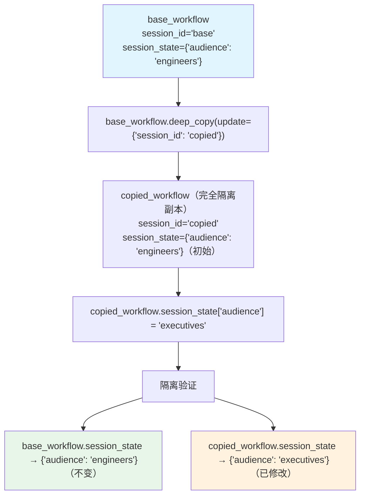

# deep_copy.py — 实现原理分析

> 源文件：`cookbook/04_workflows/06_advanced_concepts/run_control/deep_copy.py`

## 概述

本示例展示 Agno Workflow **`deep_copy(update=...)` 深度复制**机制：对 `base_workflow` 进行深度复制，同时可以覆盖指定字段，副本与原 Workflow 完全隔离（互不影响），适用于为不同会话或租户创建独立的 Workflow 实例。

**核心配置一览：**

| 配置项 | 值 | 说明 |
|--------|------|------|
| `workflow.deep_copy(update={...})` | 覆盖字段的字典 | 深度复制并更新 |
| 隔离范围 | `session_state`, `metadata`, `steps`, `session_id` | 全部深度复制 |
| 互不影响 | 修改副本不影响原本 | 真正的深拷贝 |

## 核心组件解析

### 创建基础 Workflow

```python
base_workflow = Workflow(
    name="Base Editorial Workflow",
    steps=[outline_step],
    session_id="base-session",
    session_state={"audience": "engineers", "tone": "concise"},
    metadata={"owner": "editorial"},
)
```

### 深度复制并覆盖字段

```python
copied_workflow = base_workflow.deep_copy(
    update={
        "name": "Copied Editorial Workflow",
        "session_id": "copied-session",
    }
)

# 修改副本的 session_state（不影响原本）
copied_workflow.session_state["audience"] = "executives"
copied_workflow.metadata["owner"] = "growth"
copied_workflow.steps[0].name = "Draft Outline Copy"
```

### 验证隔离性

```python
# 原本状态不变
print(base_workflow.session_state)   # {"audience": "engineers", "tone": "concise"}
print(base_workflow.metadata)        # {"owner": "editorial"}
print(base_workflow.steps[0].name)   # "Draft Outline"

# 副本独立修改
print(copied_workflow.session_state) # {"audience": "executives", "tone": "concise"}
print(copied_workflow.metadata)      # {"owner": "growth"}
print(copied_workflow.steps[0].name) # "Draft Outline Copy"
```

## 应用场景

| 场景 | 说明 |
|------|------|
| 多租户隔离 | 每个租户一个独立 Workflow 实例 |
| A/B 测试 | 两个 Workflow 实例对比不同配置 |
| 会话隔离 | 不同 `session_id` 互不干扰 |
| 配置模板 | Base Workflow 作为模板，按需 deep_copy |

## Mermaid 流程图



## 关键源码文件索引

| 文件 | 关键类/函数 | 作用 |
|------|------------|------|
| `agno/workflow/workflow.py` | `Workflow.deep_copy(update)` | 深度复制并支持字段覆盖 |
