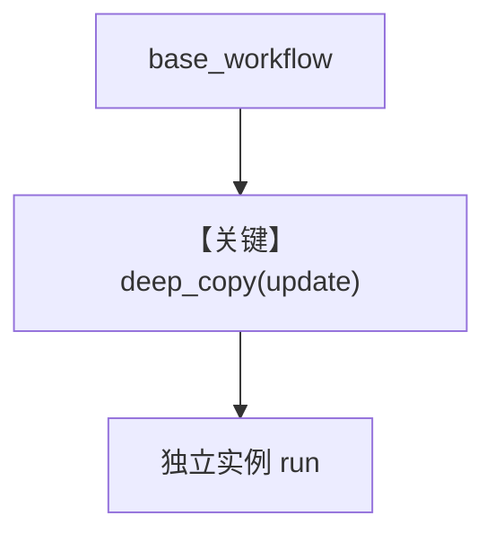

# deep_copy.py — 实现原理分析

> 源文件：`cookbook/04_workflows/06_advanced_concepts/run_control/deep_copy.py`

## 概述

本示例展示 **`Workflow.deep_copy(update={...})`**：在保留原工作流定义的同时生成独立实例，可覆盖 `name`、`session_id`、`session_state`、`metadata` 等字段，用于多租户/多会话隔离试验而不共享可变状态。

**核心配置一览：**

| 配置项 | 值 | 说明 |
|--------|------|------|
| `base_workflow` | `session_id`、`session_state`、`metadata` | `L30-37` |
| `outline_agent` | `OpenAIResponses(id="gpt-5.2")` | Responses API |
| `deep_copy(update=...)` | 见 `__main__` `L43+` | 覆盖名称/会话 |

## 核心组件解析

`deep_copy` 实现见 `workflow.py`：深拷贝 steps/agent/db 引用策略需以源码为准；`update` 字典合并进新实例。

### 运行机制与因果链

复制后的 `Workflow` 与原对象**独立运行**，避免共享 `session_state` 污染。

## System Prompt 组装

### Outline Agent

```text
Create a concise outline for the requested topic.
```

## 完整 API 请求

`OpenAIResponses` → OpenAI Responses API（非 Chat Completions）；以 `agno/models/openai/responses` 实现为准。

## Mermaid 流程图


```mermaid
flowchart TD
    B["base_workflow"] --> C["【关键】deep_copy(update)"]
    C --> N["独立实例 run"]
```

## 关键源码文件索引

| 文件 | 作用 |
|------|------|
| `agno/workflow/workflow.py` | `deep_copy()` |
