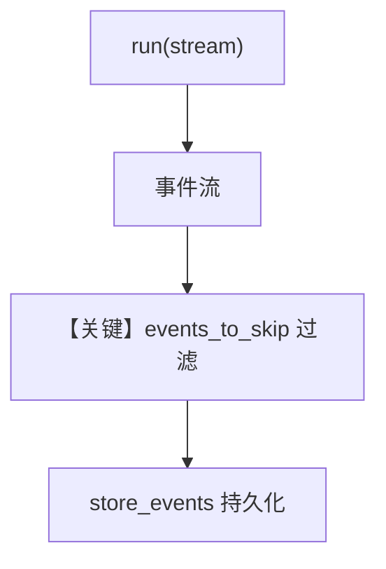

# event_storage.py — 实现原理分析

<!-- cookbook-py-source:start -->
## 完整源码

```python
"""
Event Storage
=============

Demonstrates storing workflow events while skipping selected high-volume events.
"""

from agno.agent import Agent
from agno.db.sqlite import SqliteDb
from agno.models.openai import OpenAIChat
from agno.run.agent import (
    RunContentEvent,
    RunEvent,
    ToolCallCompletedEvent,
    ToolCallStartedEvent,
)
from agno.run.workflow import WorkflowRunEvent, WorkflowRunOutput
from agno.tools.hackernews import HackerNewsTools
from agno.workflow.parallel import Parallel
from agno.workflow.step import Step
from agno.workflow.workflow import Workflow

# ---------------------------------------------------------------------------
# Create Agents
# ---------------------------------------------------------------------------
news_agent = Agent(
    name="News Agent",
    model=OpenAIChat(id="gpt-5.2"),
    tools=[HackerNewsTools()],
    instructions="You are a news researcher. Get the latest tech news and summarize key points.",
)

search_agent = Agent(
    name="Search Agent",
    model=OpenAIChat(id="gpt-5.2"),
    instructions="You are a search specialist. Find relevant information on given topics.",
)

analysis_agent = Agent(
    name="Analysis Agent",
    model=OpenAIChat(id="gpt-5.2"),
    instructions="You are an analyst. Analyze the provided information and give insights.",
)

summary_agent = Agent(
    name="Summary Agent",
    model=OpenAIChat(id="gpt-5.2"),
    instructions="You are a summarizer. Create concise summaries of the provided content.",
)

# ---------------------------------------------------------------------------
# Define Steps
# ---------------------------------------------------------------------------
research_step = Step(name="Research Step", agent=news_agent)
search_step = Step(name="Search Step", agent=search_agent)


# ---------------------------------------------------------------------------
# Helper
# ---------------------------------------------------------------------------
def print_stored_events(run_response: WorkflowRunOutput, example_name: str) -> None:
    print(f"\n--- {example_name} - Stored Events ---")
    if run_response.events:
        print(f"Total stored events: {len(run_response.events)}")
        for i, event in enumerate(run_response.events, 1):
            print(f"  {i}. {event.event}")
    else:
        print("No events stored")
    print()


# ---------------------------------------------------------------------------
# Run Examples
# ---------------------------------------------------------------------------
if __name__ == "__main__":
    print("=== Simple Step Workflow with Event Storage ===")
    step_workflow = Workflow(
        name="Simple Step Workflow",
        description="Basic workflow demonstrating step event storage",
        db=SqliteDb(session_table="workflow_session", db_file="tmp/workflow.db"),
        steps=[research_step, search_step],
        store_events=True,
        events_to_skip=[
            WorkflowRunEvent.step_started,
            WorkflowRunEvent.workflow_completed,
            RunEvent.run_content,
            RunEvent.run_started,
            RunEvent.run_completed,
        ],
    )

    print("Running Step workflow with streaming...")
    for event in step_workflow.run(
        input="AI trends in 2024",
        stream=True,
        stream_events=True,
    ):
        if not isinstance(
            event, (RunContentEvent, ToolCallStartedEvent, ToolCallCompletedEvent)
        ):
            print(
                f"Event: {event.event if hasattr(event, 'event') else type(event).__name__}"
            )
    run_response = step_workflow.get_last_run_output()

    print("\nStep workflow completed")
    print(
        f"Total events stored: {len(run_response.events) if run_response and run_response.events else 0}"
    )
    print_stored_events(run_response, "Simple Step Workflow")

    print("=== Parallel Example ===")
    parallel_workflow = Workflow(
        name="Parallel Research Workflow",
        steps=[
            Parallel(
                Step(name="News Research", agent=news_agent),
                Step(name="Web Search", agent=search_agent),
                name="Parallel Research",
            ),
            Step(name="Combine Results", agent=analysis_agent),
            Step(name="Summarize", agent=summary_agent),
        ],
        db=SqliteDb(
            session_table="workflow_parallel", db_file="tmp/workflow_parallel.db"
        ),
        store_events=True,
        events_to_skip=[
            WorkflowRunEvent.parallel_execution_started,
            WorkflowRunEvent.parallel_execution_completed,
        ],
    )

    print("Running Parallel workflow...")
    for event in parallel_workflow.run(
        input="Research machine learning developments",
        stream=True,
        stream_events=True,
    ):
        if not isinstance(event, RunContentEvent):
            print(
                f"Event: {event.event if hasattr(event, 'event') else type(event).__name__}"
            )

    run_response = parallel_workflow.get_last_run_output()
    print(f"Parallel workflow stored {len(run_response.events)} events")
    print_stored_events(run_response, "Parallel Workflow")
```

<!-- cookbook-py-source:end -->

> 源文件：`cookbook/04_workflows/06_advanced_concepts/run_control/event_storage.py`

## 概述

本示例展示 **`store_events=True` 与 `events_to_skip`**：在流式工作流运行中持久化事件子集，跳过高频低价值事件以控制存储体积；适用于审计与回放。

**核心配置一览：**

| 配置项 | 说明 |
|--------|------|
| `Workflow.store_events` | `True` |
| `Workflow.events_to_skip` | 列表排除指定 `RunEvent`/`WorkflowRunEvent` |
| `db` | `SqliteDb` |

## 运行机制与因果链

事件经 `WorkflowRunOutput` 写入；跳过的类型在序列化前过滤（实现见 `workflow.py` 事件持久化路径）。

## System Prompt 组装

以示例中 Agent `instructions`/`role` 为准（见源文件 Agent 段）。

## Mermaid 流程图



## 关键源码文件索引

| 文件 | 作用 |
|------|------|
| `agno/workflow/workflow.py` | `store_events` L247-250 |
