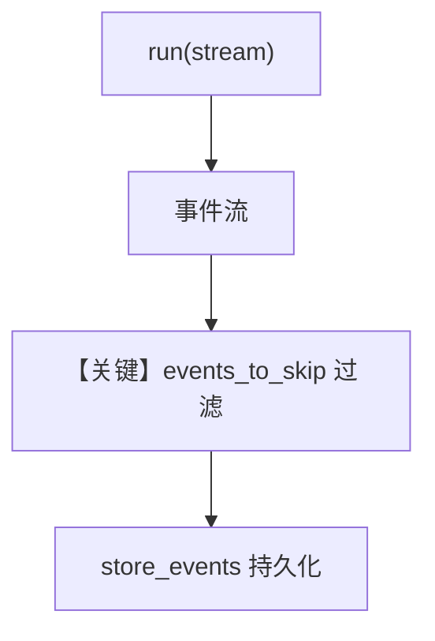

# event_storage.py — 实现原理分析

> 源文件：`cookbook/04_workflows/06_advanced_concepts/run_control/event_storage.py`

## 概述

本示例展示 **`store_events=True` 与 `events_to_skip`**：在流式工作流运行中持久化事件子集，跳过高频低价值事件以控制存储体积；适用于审计与回放。

**核心配置一览：**

| 配置项 | 说明 |
|--------|------|
| `Workflow.store_events` | `True` |
| `Workflow.events_to_skip` | 列表排除指定 `RunEvent`/`WorkflowRunEvent` |
| `db` | `SqliteDb` |

## 运行机制与因果链

事件经 `WorkflowRunOutput` 写入；跳过的类型在序列化前过滤（实现见 `workflow.py` 事件持久化路径）。

## System Prompt 组装

以示例中 Agent `instructions`/`role` 为准（见源文件 Agent 段）。

## Mermaid 流程图

## 关键源码文件索引

| 文件 | 作用 |
|------|------|
| `agno/workflow/workflow.py` | `store_events` L247-250 |
