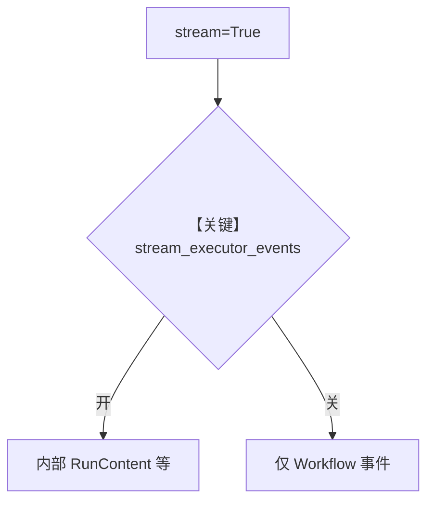

# executor_events.py — 实现原理分析

<!-- cookbook-py-source:start -->
## 完整源码

```python
"""
Executor Events
===============

Demonstrates filtering internal executor events during streamed workflow runs.
"""

from agno.agent import Agent
from agno.models.openai import OpenAIChat
from agno.workflow.step import Step
from agno.workflow.workflow import Workflow

# ---------------------------------------------------------------------------
# Create Agent
# ---------------------------------------------------------------------------
agent = Agent(
    name="ResearchAgent",
    model=OpenAIChat(id="gpt-4o"),
    instructions="You are a helpful research assistant. Be concise.",
)

# ---------------------------------------------------------------------------
# Create Workflow
# ---------------------------------------------------------------------------
workflow = Workflow(
    name="Research Workflow",
    steps=[Step(name="Research", agent=agent)],
    stream=True,
    stream_executor_events=False,
)


# ---------------------------------------------------------------------------
# Run Workflow
# ---------------------------------------------------------------------------
def main() -> None:
    print("\n" + "=" * 70)
    print("Workflow Streaming Example: stream_executor_events=False")
    print("=" * 70)
    print(
        "\nThis will show only workflow and step events and will not yield RunContent and TeamRunContent events"
    )
    print("Filtering out internal agent/team events for cleaner output.\n")

    for event in workflow.run(
        "What is Python?",
        stream=True,
        stream_events=True,
    ):
        event_name = event.event if hasattr(event, "event") else type(event).__name__
        print(f"  -> {event_name}")


if __name__ == "__main__":
    main()
```

<!-- cookbook-py-source:end -->

> 源文件：`cookbook/04_workflows/06_advanced_concepts/run_control/executor_events.py`

## 概述

本示例展示 **`stream_executor_events`（及同类标志）控制是否向下游暴露 Agent/Team 内部事件**：在流式工作流中减少噪声或仅关注工作流级事件。

**核心配置一览：**

| 配置项 | 说明 |
|--------|------|
| `Workflow.stream_executor_events` | 典型为 `False` 过滤内部执行器事件 |
| `stream` / `stream_events` | 与总流式开关配合 |

## 运行机制与因果链

关闭时消费者仅见 Workflow 层事件，不见子 Agent 逐 token 事件（具体过滤点在 `workflow.py` 流式迭代器）。

## System Prompt 组装

见各 `Step` 绑定 Agent 的 instructions。

## Mermaid 流程图



## 关键源码文件索引

| 文件 | 作用 |
|------|------|
| `agno/workflow/workflow.py` | `stream_executor_events` L244-245 |
