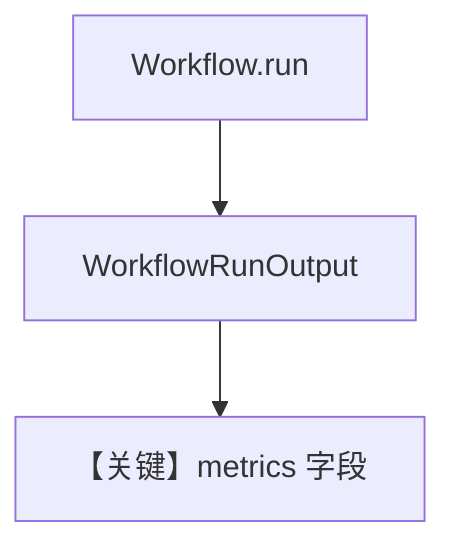

# metrics.py — 实现原理分析

> 源文件：`cookbook/04_workflows/06_advanced_concepts/run_control/metrics.py`

## 概述

本示例展示从 **`WorkflowRunOutput`** 读取工作流级与步骤级 **`RunMetrics`/`WorkflowMetrics`**：用于耗时、token、步数等观测；常配合 `db` 持久化 run。

**核心配置一览：**

| 配置项 | 说明 |
|--------|------|
| `workflow.run()` 返回值 | 含 `metrics` |
| `StepMetrics` | 各步聚合（若启用） |

## 运行机制与因果链

`workflow.py` 在 run 结束 `_aggregate_workflow_metrics`（参见 `~L1942` 一带）合并子步指标。

## System Prompt 组装

与 metrics 无直接 LLM 关系；Agent instructions 见源文件。

## Mermaid 流程图

## 关键源码文件索引

| 文件 | 作用 |
|------|------|
| `agno/models/metrics.py` | `RunMetrics` 等 |
| `agno/workflow/workflow.py` | `_aggregate_workflow_metrics` |
