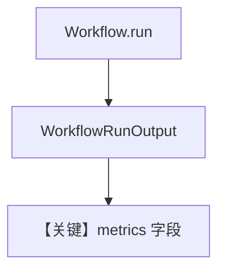

# metrics.py — 实现原理分析

<!-- cookbook-py-source:start -->
## 完整源码

```python
"""
Workflow Metrics
================

Demonstrates reading workflow and step-level metrics from `WorkflowRunOutput`.
"""

import json

from agno.agent import Agent
from agno.db.sqlite import SqliteDb
from agno.models.openai import OpenAIChat
from agno.run.workflow import WorkflowRunOutput
from agno.team import Team
from agno.tools.hackernews import HackerNewsTools
from agno.tools.websearch import WebSearchTools
from agno.workflow.step import Step
from agno.workflow.workflow import Workflow

# ---------------------------------------------------------------------------
# Create Agents
# ---------------------------------------------------------------------------
hackernews_agent = Agent(
    name="Hackernews Agent",
    model=OpenAIChat(id="gpt-4o-mini"),
    tools=[HackerNewsTools()],
    role="Extract key insights and content from Hackernews posts",
)

web_agent = Agent(
    name="Web Agent",
    model=OpenAIChat(id="gpt-4o-mini"),
    tools=[WebSearchTools()],
    role="Search the web for the latest news and trends",
)

content_planner = Agent(
    name="Content Planner",
    model=OpenAIChat(id="gpt-4o"),
    instructions=[
        "Plan a content schedule over 4 weeks for the provided topic and research content",
        "Ensure that I have posts for 3 posts per week",
    ],
)

# ---------------------------------------------------------------------------
# Create Team
# ---------------------------------------------------------------------------
research_team = Team(
    name="Research Team",
    members=[hackernews_agent, web_agent],
    instructions="Research tech topics from Hackernews and the web",
)

# ---------------------------------------------------------------------------
# Define Steps
# ---------------------------------------------------------------------------
research_step = Step(name="Research Step", team=research_team)
content_planning_step = Step(name="Content Planning Step", agent=content_planner)

# ---------------------------------------------------------------------------
# Run Workflow
# ---------------------------------------------------------------------------
if __name__ == "__main__":
    content_creation_workflow = Workflow(
        name="Content Creation Workflow",
        description="Automated content creation from blog posts to social media",
        db=SqliteDb(session_table="workflow_session", db_file="tmp/workflow.db"),
        steps=[research_step, content_planning_step],
    )
    workflow_run_response: WorkflowRunOutput = content_creation_workflow.run(
        input="AI trends in 2024"
    )

    if workflow_run_response.metrics:
        print("\n" + "-" * 60)
        print("WORKFLOW METRICS")
        print("-" * 60)
        print(json.dumps(workflow_run_response.metrics.to_dict(), indent=2))

        print("\nWORKFLOW DURATION")
        if workflow_run_response.metrics.duration:
            print(
                f"Total execution time: {workflow_run_response.metrics.duration:.2f} seconds"
            )

        print("\nSTEP-LEVEL METRICS")
        for step_name, step_metrics in workflow_run_response.metrics.steps.items():
            print(f"\nStep: {step_name}")
            if step_metrics.metrics and step_metrics.metrics.duration:
                print(f"  Duration: {step_metrics.metrics.duration:.2f} seconds")
            if step_metrics.metrics and step_metrics.metrics.total_tokens:
                print(f"  Tokens: {step_metrics.metrics.total_tokens}")
    else:
        print("\nNo workflow metrics available")
```

<!-- cookbook-py-source:end -->

> 源文件：`cookbook/04_workflows/06_advanced_concepts/run_control/metrics.py`

## 概述

本示例展示从 **`WorkflowRunOutput`** 读取工作流级与步骤级 **`RunMetrics`/`WorkflowMetrics`**：用于耗时、token、步数等观测；常配合 `db` 持久化 run。

**核心配置一览：**

| 配置项 | 说明 |
|--------|------|
| `workflow.run()` 返回值 | 含 `metrics` |
| `StepMetrics` | 各步聚合（若启用） |

## 运行机制与因果链

`workflow.py` 在 run 结束 `_aggregate_workflow_metrics`（参见 `~L1942` 一带）合并子步指标。

## System Prompt 组装

与 metrics 无直接 LLM 关系；Agent instructions 见源文件。

## Mermaid 流程图



## 关键源码文件索引

| 文件 | 作用 |
|------|------|
| `agno/models/metrics.py` | `RunMetrics` 等 |
| `agno/workflow/workflow.py` | `_aggregate_workflow_metrics` |
