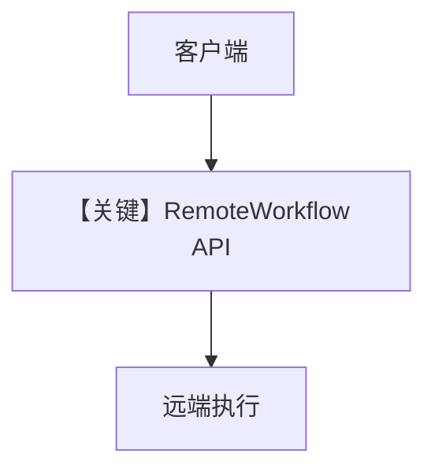

# remote_workflow.py — 实现原理分析

> 源文件：`cookbook/04_workflows/06_advanced_concepts/run_control/remote_workflow.py`

## 概述

本示例展示 **`RemoteWorkflow`**：客户端不本地构造 `Workflow` 图，而是向远程 AgentOS/HTTP 端点发起执行，适合拆分部署与资源隔离。

**核心配置一览：**

| 配置项 | 说明 |
|--------|------|
| `RemoteWorkflow` | URL、鉴权、workflow id 等（见源文件） |
| 环境变量 | 如 `AGENTOS_URL` |

## 运行机制与因果链

请求经网络序列化输入，响应反序列化为 `WorkflowRunOutput` 或流式事件。

## System Prompt 组装

提示词在**远端**工作流定义；本地无 `get_system_message`。

## Mermaid 流程图

## 关键源码文件索引

| 文件 | 作用 |
|------|------|
| `agno/workflow/remote.py` | `RemoteWorkflow` |
