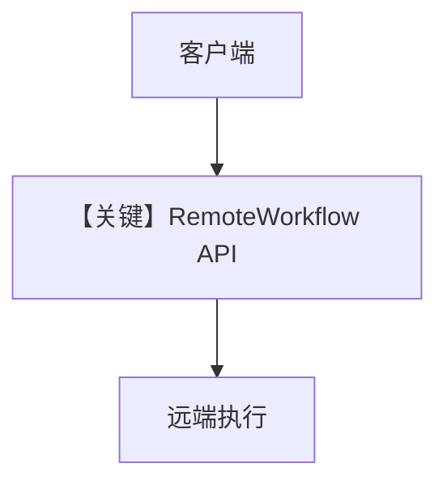

# remote_workflow.py — 实现原理分析

<!-- cookbook-py-source:start -->
## 完整源码

```python
"""
Remote Workflow
===============

Demonstrates executing a workflow hosted on a remote server using `RemoteWorkflow`.
"""

import asyncio
import os

from agno.workflow import RemoteWorkflow

# ---------------------------------------------------------------------------
# Create Remote Workflow
# ---------------------------------------------------------------------------
remote_workflow = RemoteWorkflow(
    base_url=os.getenv("AGNO_REMOTE_BASE_URL", "http://localhost:7777"),
    workflow_id=os.getenv("AGNO_REMOTE_WORKFLOW_ID", "qa-workflow"),
)


async def run_remote_examples() -> None:
    print("Remote workflow configuration")
    print(f"  Base URL: {remote_workflow.base_url}")
    print(f"  Workflow ID: {remote_workflow.id}")

    try:
        response = await remote_workflow.arun(
            input="Summarize the latest progress in AI coding assistants.",
            stream=False,
        )
        print("\nNon-streaming response preview")
        print(f"  Run ID: {response.run_id}")
        print(f"  Content: {str(response.content)[:240]}")
    except Exception as exc:
        print("\nRemote run failed.")
        print("  Ensure AgentOS is running and the workflow ID exists.")
        print(f"  Error: {exc}")
        return

    try:
        print("\nStreaming response preview")
        stream = remote_workflow.arun(
            input="List three practical use-cases for autonomous workflows.",
            stream=True,
            stream_events=True,
        )
        async for event in stream:
            event_name = getattr(event, "event", type(event).__name__)
            content = getattr(event, "content", None)
            if content:
                print(content, end="", flush=True)
            elif event_name:
                print(f"\n[{event_name}]")
        print()
    except Exception as exc:
        print("\nStreaming run failed.")
        print(f"  Error: {exc}")


# ---------------------------------------------------------------------------
# Run Workflow
# ---------------------------------------------------------------------------
if __name__ == "__main__":
    asyncio.run(run_remote_examples())
```

<!-- cookbook-py-source:end -->

> 源文件：`cookbook/04_workflows/06_advanced_concepts/run_control/remote_workflow.py`

## 概述

本示例展示 **`RemoteWorkflow`**：客户端不本地构造 `Workflow` 图，而是向远程 AgentOS/HTTP 端点发起执行，适合拆分部署与资源隔离。

**核心配置一览：**

| 配置项 | 说明 |
|--------|------|
| `RemoteWorkflow` | URL、鉴权、workflow id 等（见源文件） |
| 环境变量 | 如 `AGENTOS_URL` |

## 运行机制与因果链

请求经网络序列化输入，响应反序列化为 `WorkflowRunOutput` 或流式事件。

## System Prompt 组装

提示词在**远端**工作流定义；本地无 `get_system_message`。

## Mermaid 流程图



## 关键源码文件索引

| 文件 | 作用 |
|------|------|
| `agno/workflow/remote.py` | `RemoteWorkflow` |
