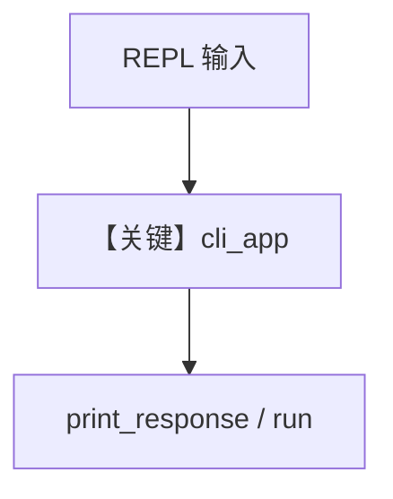

# workflow_cli.py — 实现原理分析

> 源文件：`cookbook/04_workflows/06_advanced_concepts/run_control/workflow_cli.py`

## 概述

本示例展示 **`Workflow.cli_app()`**：交互式命令行循环读取用户输入并调用 `print_response`/`run`，支持 `session_id`、`stream`、`show_step_details` 等（与 `continuous_execution` 类似但侧重 CLI 入口）。

**核心配置一览：**

| 配置项 | 说明 |
|--------|------|
| `cli_app(...)` | 参数见 `__main__` |
| `model` | 示例可能为 `OpenAIResponses` |

## 运行机制与因果链

同一会话多轮输入依赖 `db` + `session_id`；退出命令由 CLI 实现解析。

## System Prompt 组装

见所配置 Agent 的 `instructions`。

## Mermaid 流程图

## 关键源码文件索引

| 文件 | 作用 |
|------|------|
| `agno/workflow/workflow.py` | `cli_app` |
