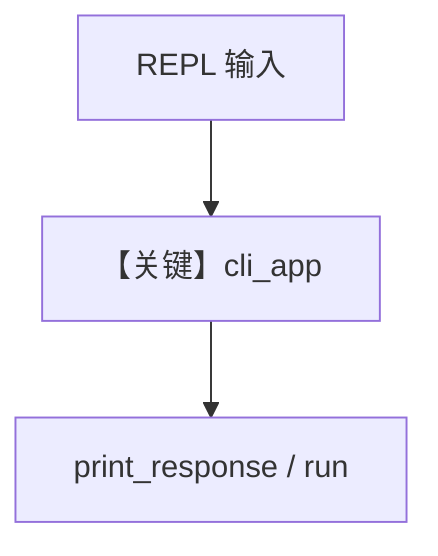

# workflow_cli.py — 实现原理分析

<!-- cookbook-py-source:start -->
## 完整源码

```python
"""
Workflow CLI
============

Demonstrates using `Workflow.cli_app()` for interactive command-line workflow runs.
"""

import os
import sys

from agno.agent import Agent
from agno.models.openai import OpenAIResponses
from agno.workflow import Workflow
from agno.workflow.step import Step

# ---------------------------------------------------------------------------
# Create Agent
# ---------------------------------------------------------------------------
assistant_agent = Agent(
    name="CLI Assistant",
    model=OpenAIResponses(id="gpt-5.2"),
    instructions="Answer clearly and provide concise, actionable output.",
)

# ---------------------------------------------------------------------------
# Define Steps
# ---------------------------------------------------------------------------
assistant_step = Step(name="Assistant", agent=assistant_agent)

# ---------------------------------------------------------------------------
# Create Workflow
# ---------------------------------------------------------------------------
workflow = Workflow(
    name="Workflow CLI Demo",
    description="Simple workflow used to demonstrate the built-in CLI app.",
    steps=[assistant_step],
)

# ---------------------------------------------------------------------------
# Run Workflow
# ---------------------------------------------------------------------------
if __name__ == "__main__":
    starter_prompt = os.getenv(
        "WORKFLOW_CLI_PROMPT",
        "Create a three-step plan for shipping a workflow feature.",
    )

    if sys.stdin.isatty():
        print("Starting interactive workflow CLI. Type 'exit' to stop.")
        workflow.cli_app(
            input=starter_prompt,
            stream=True,
            user="Developer",
            exit_on=["exit", "quit"],
        )
    else:
        print("Non-interactive environment detected; running a single response.")
        workflow.print_response(input=starter_prompt, stream=True)
        print("Run this script in a terminal to use interactive cli_app mode.")
```

<!-- cookbook-py-source:end -->

> 源文件：`cookbook/04_workflows/06_advanced_concepts/run_control/workflow_cli.py`

## 概述

本示例展示 **`Workflow.cli_app()`**：交互式命令行循环读取用户输入并调用 `print_response`/`run`，支持 `session_id`、`stream`、`show_step_details` 等（与 `continuous_execution` 类似但侧重 CLI 入口）。

**核心配置一览：**

| 配置项 | 说明 |
|--------|------|
| `cli_app(...)` | 参数见 `__main__` |
| `model` | 示例可能为 `OpenAIResponses` |

## 运行机制与因果链

同一会话多轮输入依赖 `db` + `session_id`；退出命令由 CLI 实现解析。

## System Prompt 组装

见所配置 Agent 的 `instructions`。

## Mermaid 流程图



## 关键源码文件索引

| 文件 | 作用 |
|------|------|
| `agno/workflow/workflow.py` | `cli_app` |
