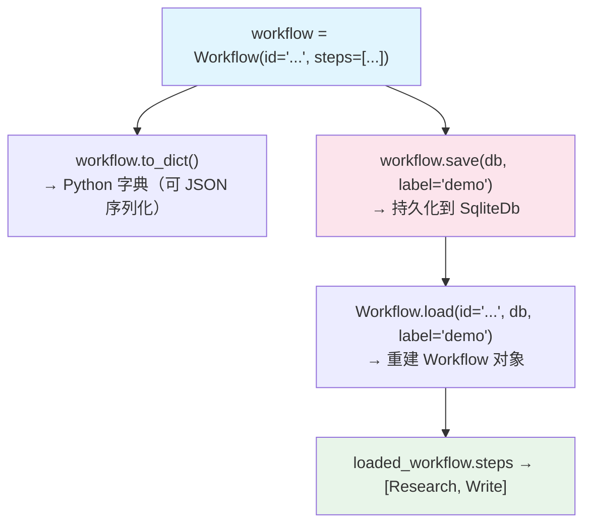

# workflow_serialization.py — 实现原理分析

> 源文件：`cookbook/04_workflows/06_advanced_concepts/run_control/workflow_serialization.py`

## 概述

本示例展示 Agno Workflow **序列化（`to_dict`/`save`）和反序列化（`load`）** API：Workflow 可以被序列化为字典（用于 JSON 传输或日志），也可以保存到数据库并按 `id` + `label` 加载，实现跨进程、跨部署的 Workflow 持久化和复现。

**核心配置一览：**

| API | 说明 |
|-----|------|
| `workflow.to_dict()` | 序列化为 Python 字典 |
| `workflow.save(db=..., label=...)` | 保存到数据库（含版本标签） |
| `Workflow.load(id=..., db=..., label=...)` | 从数据库加载 Workflow |

## 核心组件解析

### 序列化为字典

```python
workflow_dict = workflow.to_dict()
# 返回: {"id": "...", "name": "...", "steps": [...], "metadata": {...}, ...}
print(json.dumps(workflow_dict, indent=2)[:1200])  # 预览前 1200 字符
```

### 保存到数据库

```python
version = workflow.save(
    db=workflow_db,            # SqliteDb 实例
    label="serialization-demo",  # 版本标签
)
print(f"Saved workflow version: {version}")
```

### 从数据库加载

```python
loaded_workflow = Workflow.load(
    id="serialization-demo-workflow",   # Workflow 的唯一 ID
    db=workflow_db,
    label="serialization-demo",         # 版本标签（可选）
)

if loaded_workflow:
    step_names = [step.name for step in loaded_workflow.steps]
    print(f"Loaded steps: {step_names}")
```

### Workflow 配置 ID

```python
workflow = Workflow(
    id="serialization-demo-workflow",   # 显式设置 ID（用于 load）
    name="Serialization Demo Workflow",
    db=workflow_db,
    steps=[research_step, write_step],
    metadata={"owner": "cookbook"},
)
```

## 应用场景

| 场景 | 方式 |
|------|------|
| Workflow 版本管理 | `save(label="v1.0")` + `load(label="v1.0")` |
| 跨进程传递 | `to_dict()` → JSON → 传输 → 重建 |
| 审计日志 | `to_dict()` 记录每次运行配置 |
| 蓝绿部署 | 保存新版本，按需 load 切换 |

## Mermaid 流程图



## 关键源码文件索引

| 文件 | 关键类/函数 | 作用 |
|------|------------|------|
| `agno/workflow/workflow.py` | `Workflow.to_dict()` | 序列化为字典 |
| `agno/workflow/workflow.py` | `Workflow.save(db, label)` | 保存到数据库 |
| `agno/workflow/workflow.py` | `Workflow.load(id, db, label)` | 从数据库加载 |
