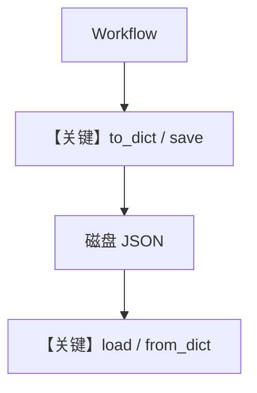

# workflow_serialization.py — 实现原理分析

> 源文件：`cookbook/04_workflows/06_advanced_concepts/run_control/workflow_serialization.py`

## 概述

本示例展示 **`Workflow.to_dict()`、`save()`、`load()`**：将工作流定义序列化为 JSON/文件，便于版本管理与无代码部署；反序列化时通过 registry/db 重建 Agent（参见 `_step_from_dict` `workflow.py` `L149-182`）。

**核心配置一览：**

| 配置项 | 说明 |
|--------|------|
| `to_dict` / `from_dict` | Step 树类型字段 `"type"` |
| `SqliteDb` | 可选，用于加载持久化 Agent |

## 运行机制与因果链

复杂对象（工具、回调）需 `Registry` 或受限序列化；Cookbook 演示最小可逆路径。

## System Prompt 组装

序列化不包含运行时消息；Agent `instructions` 在 JSON 中若存在则原样存储。

## Mermaid 流程图

```mermaid
flowchart TD
    W["Workflow"] --> D["【关键】to_dict / save"]
    D --> F["磁盘 JSON"]
    F --> L["【关键】load / from_dict"]
```

## 关键源码文件索引

| 文件 | 作用 |
|------|------|
| `agno/workflow/workflow.py` | `to_dict`；`_step_from_dict` L149 |
