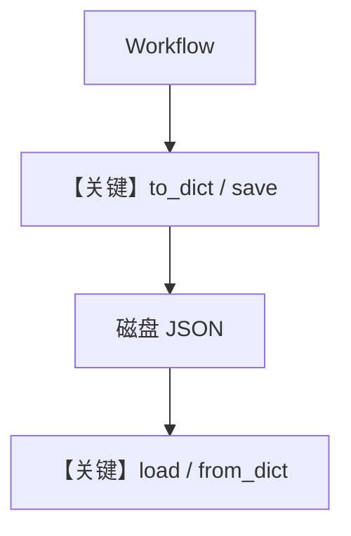

# workflow_serialization.py — 实现原理分析

<!-- cookbook-py-source:start -->
## 完整源码

```python
"""
Workflow Serialization
======================

Demonstrates `to_dict()`, `save()`, and `load()` for workflow persistence.
"""

import json

from agno.agent import Agent
from agno.db.sqlite import SqliteDb
from agno.models.openai import OpenAIResponses
from agno.workflow import Workflow
from agno.workflow.step import Step

# ---------------------------------------------------------------------------
# Create Agents
# ---------------------------------------------------------------------------
research_agent = Agent(
    name="Research Agent",
    model=OpenAIResponses(id="gpt-5.2"),
    instructions="Research the topic and gather key findings.",
)

writer_agent = Agent(
    name="Writer Agent",
    model=OpenAIResponses(id="gpt-5.2"),
    instructions="Turn research notes into a concise summary.",
)

# ---------------------------------------------------------------------------
# Define Steps
# ---------------------------------------------------------------------------
research_step = Step(name="Research", agent=research_agent)
write_step = Step(name="Write", agent=writer_agent)

# ---------------------------------------------------------------------------
# Create Workflow
# ---------------------------------------------------------------------------
workflow_db = SqliteDb(
    db_file="tmp/workflow_serialization.db", session_table="workflow_serialization"
)

workflow = Workflow(
    id="serialization-demo-workflow",
    name="Serialization Demo Workflow",
    description="Workflow used to demonstrate serialization and persistence APIs.",
    db=workflow_db,
    steps=[research_step, write_step],
    metadata={"owner": "cookbook", "topic": "serialization"},
)

# ---------------------------------------------------------------------------
# Run Workflow
# ---------------------------------------------------------------------------
if __name__ == "__main__":
    workflow_dict = workflow.to_dict()
    print("Serialized workflow dictionary")
    print(json.dumps(workflow_dict, indent=2)[:1200])

    version = workflow.save(db=workflow_db, label="serialization-demo")
    print(f"\nSaved workflow version: {version}")

    loaded_workflow = Workflow.load(
        id="serialization-demo-workflow",
        db=workflow_db,
        label="serialization-demo",
    )

    if loaded_workflow is None:
        print("Failed to load workflow from the database.")
    else:
        step_names = []
        if isinstance(loaded_workflow.steps, list):
            step_names = [
                step.name for step in loaded_workflow.steps if hasattr(step, "name")
            ]

        print("\nLoaded workflow summary")
        print(f"  Name: {loaded_workflow.name}")
        print(f"  Description: {loaded_workflow.description}")
        print(f"  Steps: {step_names}")
```

<!-- cookbook-py-source:end -->

> 源文件：`cookbook/04_workflows/06_advanced_concepts/run_control/workflow_serialization.py`

## 概述

本示例展示 **`Workflow.to_dict()`、`save()`、`load()`**：将工作流定义序列化为 JSON/文件，便于版本管理与无代码部署；反序列化时通过 registry/db 重建 Agent（参见 `_step_from_dict` `workflow.py` `L149-182`）。

**核心配置一览：**

| 配置项 | 说明 |
|--------|------|
| `to_dict` / `from_dict` | Step 树类型字段 `"type"` |
| `SqliteDb` | 可选，用于加载持久化 Agent |

## 运行机制与因果链

复杂对象（工具、回调）需 `Registry` 或受限序列化；Cookbook 演示最小可逆路径。

## System Prompt 组装

序列化不包含运行时消息；Agent `instructions` 在 JSON 中若存在则原样存储。

## Mermaid 流程图


```mermaid
flowchart TD
    W["Workflow"] --> D["【关键】to_dict / save"]
    D --> F["磁盘 JSON"]
    F --> L["【关键】load / from_dict"]
```

## 关键源码文件索引

| 文件 | 作用 |
|------|------|
| `agno/workflow/workflow.py` | `to_dict`；`_step_from_dict` L149 |
