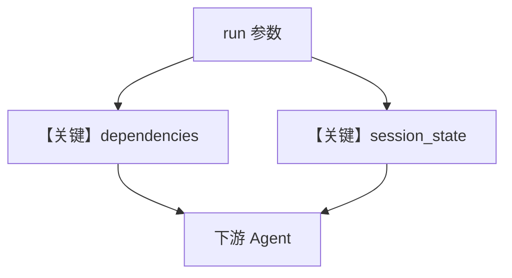

# workflow_all_params.py — 实现原理分析

<!-- cookbook-py-source:start -->
## 完整源码

```python
"""
Workflow All Run Params
=======================

Demonstrates using all workflow run-level parameters together in a realistic
content creation pipeline.

This example shows:
  - metadata: Tagging runs with project and environment info
  - dependencies: Injecting configuration (tone, word count, target audience)
  - add_dependencies_to_context: Making config visible to agents
  - add_session_state_to_context: Making session state visible to agents
"""

import asyncio

from agno.agent import Agent
from agno.models.openai import OpenAIChat
from agno.workflow.step import Step
from agno.workflow.workflow import Workflow

# ---------------------------------------------------------------------------
# Create Agents
# ---------------------------------------------------------------------------
researcher = Agent(
    name="Content Researcher",
    model=OpenAIChat(id="gpt-4o-mini"),
    instructions=[
        "You are a content researcher.",
        "Research the given topic and provide 3-5 key points.",
        "Check your context for configuration like target audience and tone.",
        "Tailor your research to the specified audience if provided.",
        "Be concise and factual.",
    ],
)

writer = Agent(
    name="Content Writer",
    model=OpenAIChat(id="gpt-4o-mini"),
    instructions=[
        "You are a content writer.",
        "Take the research from the previous step and write a short article.",
        "Check your context for configuration like tone, word count, and target audience.",
        "Follow the specified tone and word count if provided.",
        "Write engaging, clear content.",
    ],
)

# ---------------------------------------------------------------------------
# Create Steps
# ---------------------------------------------------------------------------
research_step = Step(
    name="Research",
    description="Research the topic",
    agent=researcher,
)

writing_step = Step(
    name="Write",
    description="Write the article based on research",
    agent=writer,
)

# ---------------------------------------------------------------------------
# Create Workflow with all params
# ---------------------------------------------------------------------------
content_pipeline = Workflow(
    name="Content Pipeline",
    steps=[research_step, writing_step],
    # Workflow-level metadata (always present)
    metadata={"project": "blog", "version": "1.0"},
    # Workflow-level dependencies (default configuration)
    dependencies={
        "tone": "professional",
        "max_words": 200,
        "target_audience": "developers",
    },
    # Context flags: all agents see dependencies and session state
    add_dependencies_to_context=True,
    add_session_state_to_context=True,
    # Initial session state
    session_state={"articles_written": 0},
)

# ---------------------------------------------------------------------------
# Run Workflow
# ---------------------------------------------------------------------------
if __name__ == "__main__":
    # Example 1: Using workflow defaults
    print("=== Example 1: Workflow defaults ===")
    print("Using default tone=professional, audience=developers\n")
    content_pipeline.print_response(
        input="Write about the benefits of type hints in Python.",
    )

    # Example 2: Run level overrides for a different audience
    print("\n=== Example 2: Run level overrides ===")
    print("Overriding: tone=casual, audience=beginners\n")
    content_pipeline.print_response(
        input="Write about getting started with Python.",
        # Override specific dependencies at call site
        dependencies={"tone": "casual", "target_audience": "beginners"},
        # Add call-site metadata
        metadata={"campaign": "onboarding"},
    )

    # Example 3: Async execution
    print("\n=== Example 3: Async execution ===")
    asyncio.run(
        content_pipeline.aprint_response(
            input="Write about async programming in Python.",
        )
    )
```

<!-- cookbook-py-source:end -->

> 源文件：`cookbook/04_workflows/06_advanced_concepts/run_params/workflow_all_params.py`

## 概述

本示例展示一次 `run`/`print_response` 同时使用 **`metadata`、`dependencies`、`add_dependencies_to_context`、`add_session_state_to_context`**：为单次运行打标签、注入配置型依赖，并控制是否把依赖与 `session_state` 拼进下游 Agent 上下文。

**核心配置一览：**

| 参数 | 作用 |
|------|------|
| `metadata` | 项目/环境标签 |
| `dependencies` | 注入 RunContext，如语气、字数 |
| `add_dependencies_to_context` | 是否进入模型消息 |
| `add_session_state_to_context` | 会话状态是否进入模型消息 |

## 运行机制与因果链

与 `workflow_dependencies.py` 互补：本文件强调**多参数联用**的真实管线。

## System Prompt 组装

依赖与 session 若加入上下文，会出现在 `get_system_message` 附加段或 user/developer 侧，以 `_messages.py` 与 Workflow 注入逻辑为准。

## Mermaid 流程图



## 关键源码文件索引

| 文件 | 作用 |
|------|------|
| `agno/workflow/workflow.py` | `dependencies` L263-267；run 参数 |
