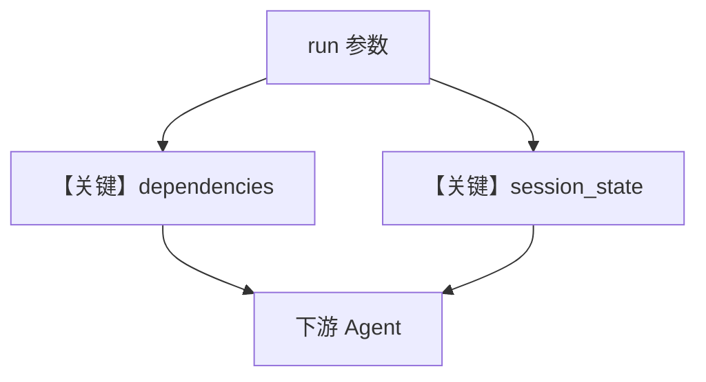

# workflow_all_params.py — 实现原理分析

> 源文件：`cookbook/04_workflows/06_advanced_concepts/run_params/workflow_all_params.py`

## 概述

本示例展示一次 `run`/`print_response` 同时使用 **`metadata`、`dependencies`、`add_dependencies_to_context`、`add_session_state_to_context`**：为单次运行打标签、注入配置型依赖，并控制是否把依赖与 `session_state` 拼进下游 Agent 上下文。

**核心配置一览：**

| 参数 | 作用 |
|------|------|
| `metadata` | 项目/环境标签 |
| `dependencies` | 注入 RunContext，如语气、字数 |
| `add_dependencies_to_context` | 是否进入模型消息 |
| `add_session_state_to_context` | 会话状态是否进入模型消息 |

## 运行机制与因果链

与 `workflow_dependencies.py` 互补：本文件强调**多参数联用**的真实管线。

## System Prompt 组装

依赖与 session 若加入上下文，会出现在 `get_system_message` 附加段或 user/developer 侧，以 `_messages.py` 与 Workflow 注入逻辑为准。

## Mermaid 流程图

## 关键源码文件索引

| 文件 | 作用 |
|------|------|
| `agno/workflow/workflow.py` | `dependencies` L263-267；run 参数 |
