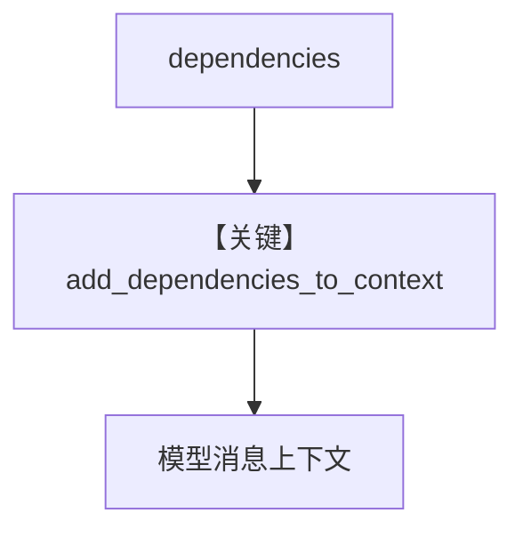

# workflow_dependencies.py — 实现原理分析

> 源文件：`cookbook/04_workflows/06_advanced_concepts/run_params/workflow_dependencies.py`

## 概述

本示例展示 **`Workflow.dependencies` + `add_dependencies_to_context=True`**：把键值配置注入 **RunContext**，并在各 Step 的 Agent 侧可见，用于统一传递语气、长度、品牌规范等，而无需改每个 Agent 构造函数。

**核心配置一览：**

| 配置项 | 说明 |
|--------|------|
| `dependencies` | `dict` |
| `add_dependencies_to_context` | 布尔 |

## 运行机制与因果链

依赖不参与 CEL 默认变量，但与「上下文注入」配合；若需 CEL 可见，多用 `additional_data`/`session_state`。

## System Prompt 组装

注入后表现为额外 system/user 段（具体格式以框架拼接为准）。

## Mermaid 流程图

## 关键源码文件索引

| 文件 | 作用 |
|------|------|
| `agno/run/base.py` | `RunContext` |
| `agno/workflow/workflow.py` | 依赖传播 |
