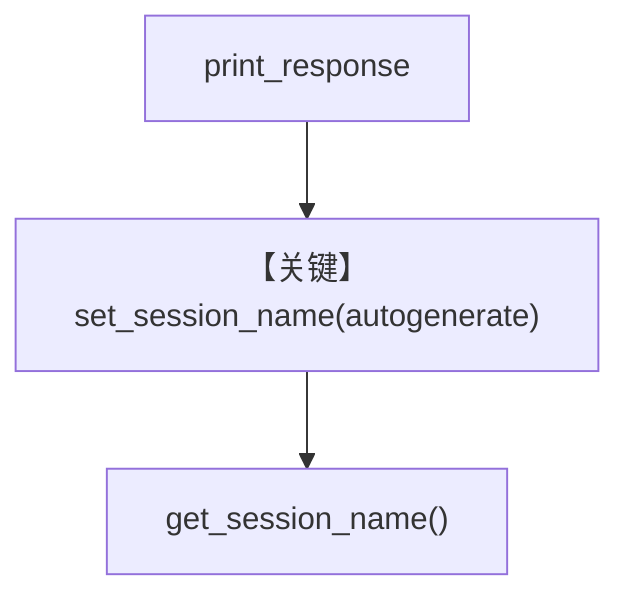

# rename_session.py — 实现原理分析

<!-- cookbook-py-source:start -->
## 完整源码

```python
"""
Rename Session
==============

Demonstrates auto-generating a workflow session name after a run.
"""

from agno.agent import Agent
from agno.db.sqlite import SqliteDb
from agno.models.openai import OpenAIChat
from agno.tools.websearch import WebSearchTools
from agno.workflow.step import Step
from agno.workflow.steps import Steps
from agno.workflow.workflow import Workflow

# ---------------------------------------------------------------------------
# Create Agents
# ---------------------------------------------------------------------------
researcher = Agent(
    name="Research Agent",
    model=OpenAIChat(id="gpt-4o-mini"),
    tools=[WebSearchTools()],
    instructions="Research the given topic and provide key facts and insights.",
)

writer = Agent(
    name="Writing Agent",
    model=OpenAIChat(id="gpt-4o"),
    instructions="Write a comprehensive article based on the research provided. Make it engaging and well-structured.",
)

# ---------------------------------------------------------------------------
# Define Steps
# ---------------------------------------------------------------------------
research_step = Step(
    name="research",
    agent=researcher,
    description="Research the topic and gather information",
)

writing_step = Step(
    name="writing",
    agent=writer,
    description="Write an article based on the research",
)

article_creation_sequence = Steps(
    name="article_creation",
    description="Complete article creation workflow from research to writing",
    steps=[research_step, writing_step],
)

# ---------------------------------------------------------------------------
# Run Workflow
# ---------------------------------------------------------------------------
if __name__ == "__main__":
    article_workflow = Workflow(
        description="Automated article creation from research to writing",
        steps=[article_creation_sequence],
        db=SqliteDb(db_file="tmp/workflows.db"),
        debug_mode=True,
    )

    article_workflow.print_response(
        input="Write an article about the benefits of renewable energy",
        markdown=True,
    )

    article_workflow.set_session_name(autogenerate=True)
    print(f"New session name: {article_workflow.get_session_name()}")
```

<!-- cookbook-py-source:end -->

> 源文件：`cookbook/04_workflows/06_advanced_concepts/session_state/rename_session.py`

## 概述

本示例展示 **`Workflow.set_session_name(autogenerate=True)`** 与 **`get_session_name()`**：在 `print_response` 运行后根据会话内容或规则自动生成可读会话名，便于在 DB 或 UI 中区分（`L69-70`）。

**核心配置一览：**

| 配置项 | 值 |
|--------|-----|
| `Steps` | `article_creation` 含 research + writing |
| `db` | `tmp/workflows.db` |
| `set_session_name(autogenerate=True)` | `L69` |

## 核心组件解析

会话重命名逻辑在 `Workflow` / session 管理模块中实现；依赖 `db` 持久化会话记录。

## System Prompt 组装

```text
Research the given topic and provide key facts and insights.
```

```text
Write a comprehensive article based on the research provided. Make it engaging and well-structured.
```

## Mermaid 流程图



## 关键源码文件索引

| 文件 | 作用 |
|------|------|
| `agno/workflow/workflow.py` | `set_session_name` / `get_session_name` |
