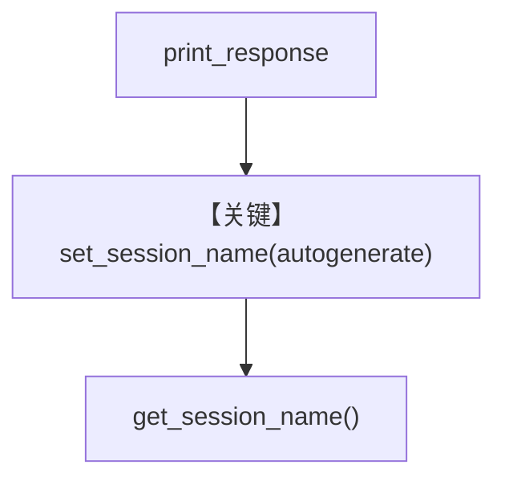

# rename_session.py — 实现原理分析

> 源文件：`cookbook/04_workflows/06_advanced_concepts/session_state/rename_session.py`

## 概述

本示例展示 **`Workflow.set_session_name(autogenerate=True)`** 与 **`get_session_name()`**：在 `print_response` 运行后根据会话内容或规则自动生成可读会话名，便于在 DB 或 UI 中区分（`L69-70`）。

**核心配置一览：**

| 配置项 | 值 |
|--------|-----|
| `Steps` | `article_creation` 含 research + writing |
| `db` | `tmp/workflows.db` |
| `set_session_name(autogenerate=True)` | `L69` |

## 核心组件解析

会话重命名逻辑在 `Workflow` / session 管理模块中实现；依赖 `db` 持久化会话记录。

## System Prompt 组装

```text
Research the given topic and provide key facts and insights.
```

```text
Write a comprehensive article based on the research provided. Make it engaging and well-structured.
```

## Mermaid 流程图



## 关键源码文件索引

| 文件 | 作用 |
|------|------|
| `agno/workflow/workflow.py` | `set_session_name` / `get_session_name` |
