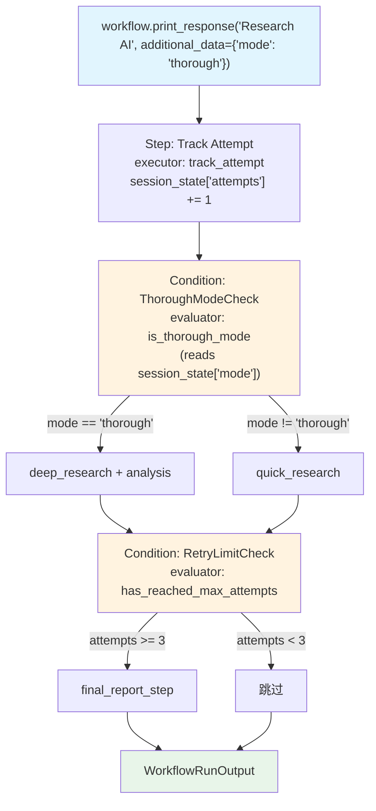

# state_in_condition.py — 实现原理分析

> 源文件：`cookbook/04_workflows/06_advanced_concepts/session_state/state_in_condition.py`

## 概述

本示例展示 Agno Workflow `session_state` 在 **`Condition` 评估器和执行器**中的应用：`Condition.evaluator` 函数通过 `step_input` 上下文读取 `session_state` 来决定是否执行分支，步骤执行器也可以更新 `session_state`，实现有状态的条件路由。

**核心配置一览：**

| 配置项 | 值 | 说明 |
|--------|------|------|
| `session_state` 初始 | `{"mode": "fast", "attempts": 0}` | 路由控制变量 |
| evaluator 访问 | `step_input.session_state.get("mode")` | 直接读取状态字段 |
| executor 更新 | `step_input.session_state["attempts"] += 1` | 更新状态字段 |

## 核心组件解析

### Condition evaluator 读取 session_state

```python
def is_thorough_mode(step_input: StepInput) -> bool:
    session_state = step_input.session_state or {}
    mode = session_state.get("mode", "fast")
    return mode == "thorough"   # 根据 session_state 决定条件

def has_reached_max_attempts(step_input: StepInput) -> bool:
    session_state = step_input.session_state or {}
    return session_state.get("attempts", 0) >= 3
```

### Executor 更新 session_state

```python
def track_attempt(step_input: StepInput) -> StepOutput:
    if step_input.session_state is not None:
        step_input.session_state["attempts"] = step_input.session_state.get("attempts", 0) + 1
        attempts = step_input.session_state["attempts"]
    return StepOutput(content=f"Attempt {attempts} recorded.")
```

### 有状态 Condition 结构

```python
workflow = Workflow(
    steps=[
        track_attempt_step,
        Condition(
            name="ThoroughModeCheck",
            evaluator=is_thorough_mode,           # 读取 session_state["mode"]
            steps=[deep_research_step, analysis_step],
            else_steps=[quick_research_step],
        ),
        Condition(
            name="RetryLimitCheck",
            evaluator=has_reached_max_attempts,   # 读取 session_state["attempts"]
            steps=[final_report_step],
        ),
    ],
    session_state={"mode": "fast", "attempts": 0},
)
```

## Mermaid 流程图



## 关键源码文件索引

| 文件 | 关键类/函数 | 作用 |
|------|------------|------|
| `agno/workflow/condition.py` | `Condition.evaluator` L79 | 支持接收 StepInput 的可调用评估器 |
| `agno/workflow/types.py` | `StepInput.session_state` | evaluator 访问 session_state 的字段 |
| `agno/workflow/workflow.py` | `Workflow.session_state` | 工作流级别共享状态容器 |
