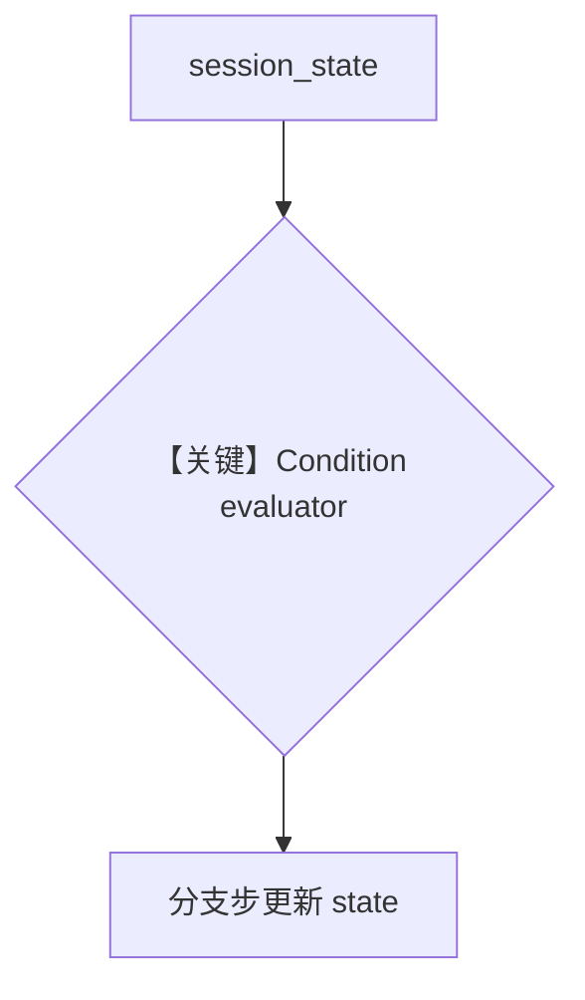

# state_in_condition.py — 实现原理分析

> 源文件：`cookbook/04_workflows/06_advanced_concepts/session_state/state_in_condition.py`

## 概述

本示例展示 **`Condition` 的 Python `evaluator(step_input)` 与 `session_state` 同步读写**：在分支判断与 executor 中更新同一 dict，实现跨步计数、配额等。

**核心配置一览：**

| 配置项 | 说明 |
|--------|------|
| `evaluator` | 读 `session_state` |
| `executor` | 写 `session_state`（见 `check_user_has_context` 等） |

## 运行机制与因果链

`session_state` 由 Workflow 合并 DB 与 run 参数（`workflow.py` `_load_session_state` 路径）；CEL 条件示例见 `cel_session_state.py`。

## Mermaid 流程图

```mermaid
flowchart TD
    S["session_state"] --> C{"【关键】Condition evaluator"}
    C --> X["分支步更新 state"]
```

## 关键源码文件索引

| 文件 | 作用 |
|------|------|
| `agno/workflow/types.py` | executor 签名含 `session_state` |
