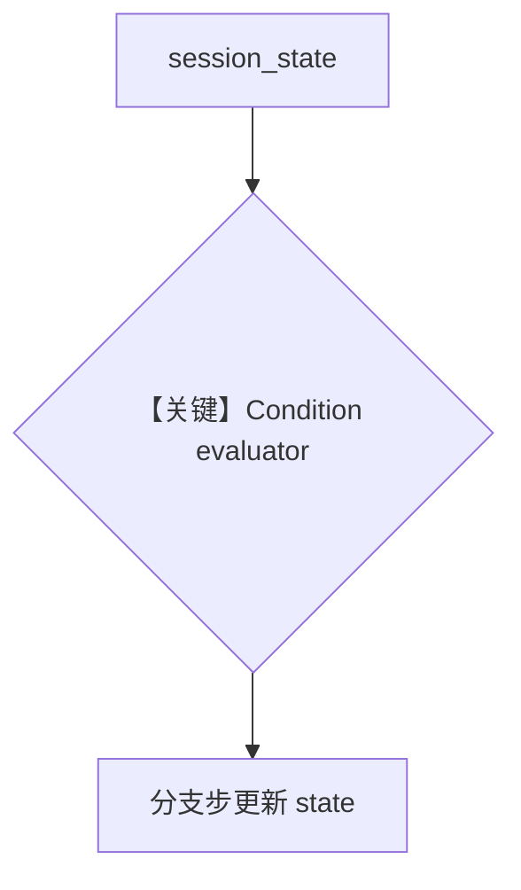

# state_in_condition.py — 实现原理分析

<!-- cookbook-py-source:start -->
## 完整源码

```python
"""
State In Condition
==================

Demonstrates using workflow session state in a `Condition` evaluator and executor functions.
"""

from agno.agent import Agent
from agno.models.openai import OpenAIChat
from agno.workflow.condition import Condition
from agno.workflow.step import Step, StepInput, StepOutput
from agno.workflow.workflow import Workflow


# ---------------------------------------------------------------------------
# Define Session-State Functions
# ---------------------------------------------------------------------------
def check_user_has_context(step_input: StepInput, session_state: dict) -> bool:
    print("\n=== Evaluating Condition ===")
    print(f"User ID: {session_state.get('current_user_id')}")
    print(f"Session ID: {session_state.get('current_session_id')}")
    print(f"Has been greeted: {session_state.get('has_been_greeted', False)}")

    return session_state.get("has_been_greeted", False)


def mark_user_as_greeted(step_input: StepInput, session_state: dict) -> StepOutput:
    print("\n=== Marking User as Greeted ===")
    session_state["has_been_greeted"] = True
    session_state["greeting_count"] = session_state.get("greeting_count", 0) + 1

    return StepOutput(
        content=f"User has been greeted. Total greetings: {session_state['greeting_count']}"
    )


# ---------------------------------------------------------------------------
# Create Agents
# ---------------------------------------------------------------------------
greeter_agent = Agent(
    name="Greeter",
    model=OpenAIChat(id="gpt-5.2"),
    instructions="Greet the user warmly and introduce yourself.",
    markdown=True,
)

contextual_agent = Agent(
    name="Contextual Assistant",
    model=OpenAIChat(id="gpt-5.2"),
    instructions="Continue the conversation with context. You already know the user.",
    markdown=True,
)

# ---------------------------------------------------------------------------
# Create Workflow
# ---------------------------------------------------------------------------
workflow = Workflow(
    name="Conditional Greeting Workflow",
    steps=[
        Condition(
            name="Check If New User",
            description="Check if this is a new user who needs greeting",
            evaluator=lambda step_input, session_state: (
                not check_user_has_context(
                    step_input,
                    session_state,
                )
            ),
            steps=[
                Step(
                    name="Greet User",
                    description="Greet the new user",
                    agent=greeter_agent,
                ),
                Step(
                    name="Mark as Greeted",
                    description="Mark user as greeted in session",
                    executor=mark_user_as_greeted,
                ),
            ],
        ),
        Step(
            name="Handle Query",
            description="Handle the user's query with or without greeting",
            agent=contextual_agent,
        ),
    ],
    session_state={
        "has_been_greeted": False,
        "greeting_count": 0,
    },
)


# ---------------------------------------------------------------------------
# Run Workflow
# ---------------------------------------------------------------------------
def run_example() -> None:
    print("=" * 80)
    print("First Run - New User (Condition will be True, greeting will happen)")
    print("=" * 80)

    workflow.print_response(
        input="Hi, can you help me with something?",
        session_id="user-123",
        user_id="user-123",
        stream=True,
    )

    print("\n" + "=" * 80)
    print("Second Run - Same Session (Skips greeting)")
    print("=" * 80)

    workflow.print_response(
        input="Tell me a joke",
        session_id="user-123",
        user_id="user-123",
        stream=True,
    )


if __name__ == "__main__":
    run_example()
```

<!-- cookbook-py-source:end -->

> 源文件：`cookbook/04_workflows/06_advanced_concepts/session_state/state_in_condition.py`

## 概述

本示例展示 **`Condition` 的 Python `evaluator(step_input)` 与 `session_state` 同步读写**：在分支判断与 executor 中更新同一 dict，实现跨步计数、配额等。

**核心配置一览：**

| 配置项 | 说明 |
|--------|------|
| `evaluator` | 读 `session_state` |
| `executor` | 写 `session_state`（见 `check_user_has_context` 等） |

## 运行机制与因果链

`session_state` 由 Workflow 合并 DB 与 run 参数（`workflow.py` `_load_session_state` 路径）；CEL 条件示例见 `cel_session_state.py`。

## Mermaid 流程图


```mermaid
flowchart TD
    S["session_state"] --> C{"【关键】Condition evaluator"}
    C --> X["分支步更新 state"]
```

## 关键源码文件索引

| 文件 | 作用 |
|------|------|
| `agno/workflow/types.py` | executor 签名含 `session_state` |
