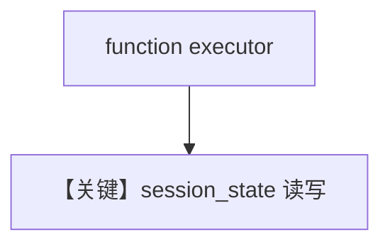

# state_in_function.py — 实现原理分析

> 源文件：`cookbook/04_workflows/06_advanced_concepts/session_state/state_in_function.py`

## 概述

本示例展示 **函数型 `executor(step_input, session_state)`** 读写会话状态：适合计数、累积用户偏好、与条件/路由组合。

## 运行机制与因果链

同 `state_in_condition.py`，侧重**非 Condition** 的普通 Step 中维护状态。

## Mermaid 流程图

## 关键源码文件索引

| 文件 | 作用 |
|------|------|
| `agno/workflow/types.py` | `StepOutput` + `session_state` |
