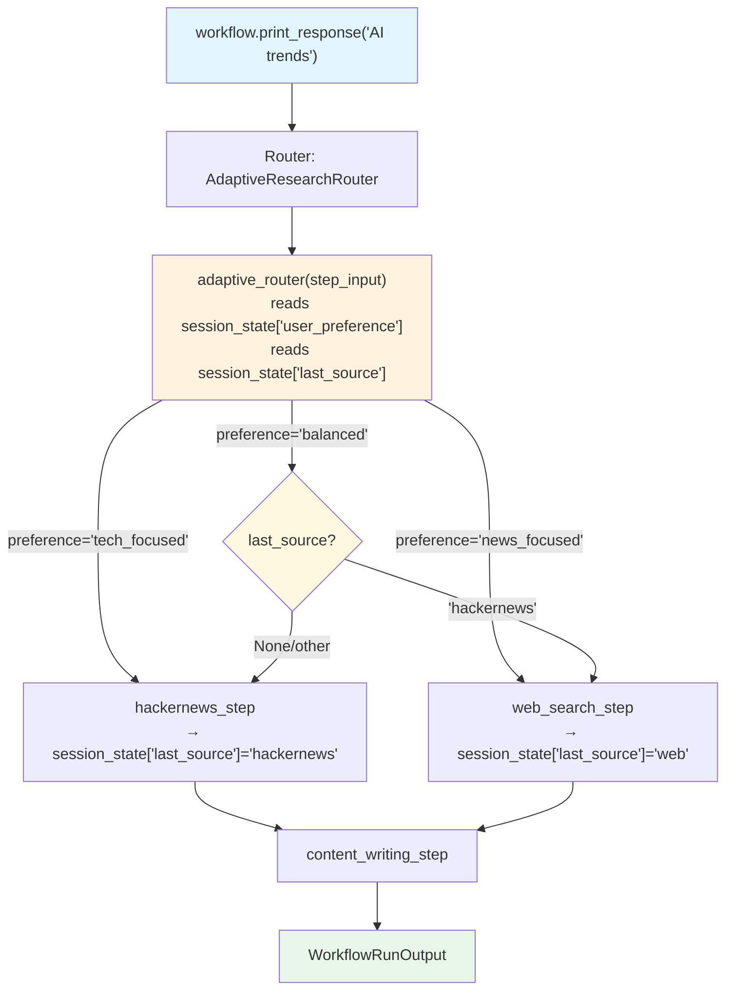

# state_in_router.py — 实现原理分析

> 源文件：`cookbook/04_workflows/06_advanced_concepts/session_state/state_in_router.py`

## 概述

本示例展示 Agno Workflow `session_state` 在 **`Router` 选择器**中的应用：`Router.selector` 函数通过 `step_input.session_state` 读取用户偏好设置来决定路由，并可在步骤执行后更新状态，实现自适应路由策略。

**核心配置一览：**

| 配置项 | 值 | 说明 |
|--------|------|------|
| `session_state` 初始 | `{"user_preference": "balanced", "last_source": None}` | 路由偏好 |
| selector 读取 | `step_input.session_state.get("user_preference")` | 偏好控制路由 |
| 执行器更新 | `step_input.session_state["last_source"] = "hackernews"` | 记录路由历史 |

## 核心组件解析

### Router selector 读取 session_state

```python
def adaptive_router(step_input: StepInput) -> List[Step]:
    session_state = step_input.session_state or {}
    preference = session_state.get("user_preference", "balanced")
    last_source = session_state.get("last_source")

    if preference == "tech_focused":
        return [hackernews_step]
    elif preference == "news_focused":
        return [web_search_step]
    elif preference == "balanced":
        # 避免重复同一来源
        if last_source == "hackernews":
            return [web_search_step]
        return [hackernews_step]
    return [hackernews_step, web_search_step]  # 默认全选
```

### Executor 更新路由历史

```python
def record_source_and_search(step_input: StepInput) -> StepOutput:
    if step_input.session_state is not None:
        step_input.session_state["last_source"] = "hackernews"
    # 执行实际的 HackerNews 搜索
    response = hackernews_agent.run(step_input.input)
    return StepOutput(content=response.content)
```

### 有状态 Router 结构

```python
workflow = Workflow(
    steps=[
        Router(
            name="AdaptiveResearchRouter",
            selector=adaptive_router,           # 读取 session_state 进行路由
            choices=[hackernews_step, web_search_step],
        ),
        content_writing_step,
    ],
    session_state={
        "user_preference": "balanced",
        "last_source": None,
    },
)
```

## Mermaid 流程图



## 关键源码文件索引

| 文件 | 关键类/函数 | 作用 |
|------|------------|------|
| `agno/workflow/router.py` | `Router.selector` L81 | 支持接收 StepInput 的路由选择函数 |
| `agno/workflow/types.py` | `StepInput.session_state` | selector 访问 session_state 的字段 |
| `agno/workflow/workflow.py` | `Workflow.session_state` | 工作流级别共享状态容器 |
