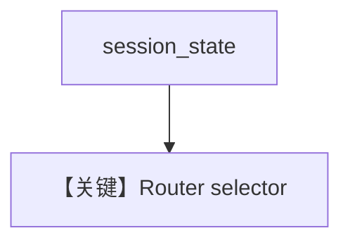

# state_in_router.py — 实现原理分析

> 源文件：`cookbook/04_workflows/06_advanced_concepts/session_state/state_in_router.py`

## 概述

本示例展示 **`Router.selector` 读取 `session_state`**（Python 或 CEL）实现持久路由偏好，与 `cel_session_state_route.py` 对照：一为代码选择器，一为 CEL 字符串。

## Mermaid 流程图

```mermaid
flowchart TD
    SS["session_state"] --> R["【关键】Router selector"]
```

## 关键源码文件索引

| 文件 | 作用 |
|------|------|
| `agno/workflow/router.py` | Router |
