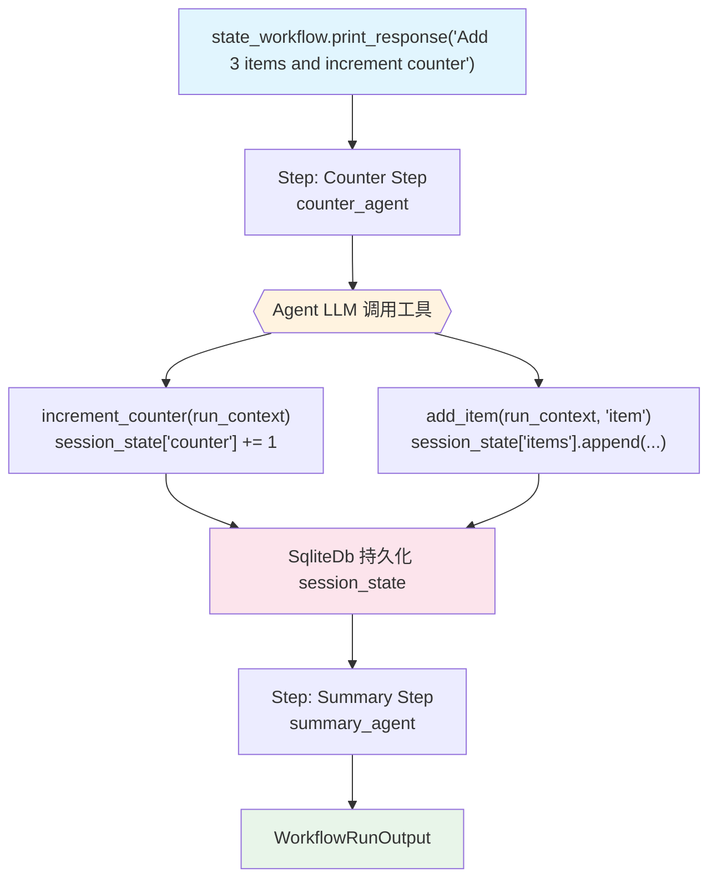

# state_with_agent.py — 实现原理分析

> 源文件：`cookbook/04_workflows/06_advanced_concepts/session_state/state_with_agent.py`

## 概述

本示例展示 Agno Workflow **`session_state` 通过 Agent 工具调用共享**机制：Agent 的自定义工具函数通过 `RunContext.session_state` 读写 Workflow 的会话状态，实现多步骤之间的结构化数据持久化（计数器、项目列表等）。

**核心配置一览：**

| 配置项 | 值 | 说明 |
|--------|------|------|
| `Workflow.session_state` | `{"counter": 0, "items": []}` | 初始状态 |
| 工具签名 | `fn(run_context: RunContext, ...)` | RunContext 自动注入 |
| `run_context.session_state` | 直接读写字典 | Agent 工具内访问状态 |
| 数据库 | `SqliteDb` | 状态跨 run 持久化 |

## 核心组件解析

### Agent 工具访问 session_state

```python
from agno.run import RunContext

def increment_counter(run_context: RunContext, amount: int = 1) -> str:
    if run_context.session_state is None:
        run_context.session_state = {}
    run_context.session_state["counter"] = run_context.session_state.get("counter", 0) + amount
    return f"Counter is now: {run_context.session_state['counter']}"

def add_item(run_context: RunContext, item: str) -> str:
    run_context.session_state.setdefault("items", []).append(item)
    return f"Added '{item}'. Items: {run_context.session_state['items']}"
```

### Agent 绑定工具

```python
counter_agent = Agent(
    model=OpenAIChat(id="gpt-4o"),
    tools=[increment_counter, add_item],    # 绑定读写 session_state 的工具
    instructions="Use tools to manage the counter and items list.",
)
```

### Workflow 配置 session_state

```python
state_workflow = Workflow(
    name="State with Agent",
    db=SqliteDb(db_file="tmp/workflow.db"),
    steps=[counter_step, summary_step],
    session_state={"counter": 0, "items": []},  # 初始化状态
)
```

## 数据流图

```
Workflow.session_state = {"counter": 0, "items": []}
        ↓ 注入 RunContext
counter_agent 工具调用:
  increment_counter(run_context) → session_state["counter"] += 1
  add_item(run_context, "task1") → session_state["items"].append("task1")
        ↓
session_state = {"counter": 1, "items": ["task1"]}  (持久化到 SqliteDb)
        ↓ 下一步读取
summary_step: step_input.additional_data 或 workflow.session_state
```

## Mermaid 流程图



## 关键源码文件索引

| 文件 | 关键类/函数 | 作用 |
|------|------------|------|
| `agno/workflow/workflow.py` | `Workflow.session_state` | 工作流级别共享状态 |
| `agno/run/context.py` | `RunContext.session_state` | 工具函数内访问状态的通道 |
| `agno/db/sqlite.py` | `SqliteDb` | session_state 跨 run 持久化 |
