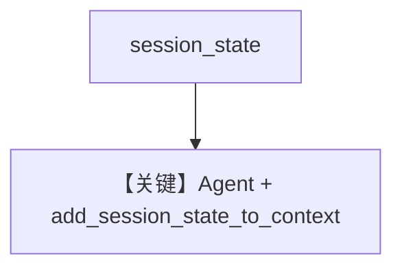

# state_with_agent.py — 实现原理分析

> 源文件：`cookbook/04_workflows/06_advanced_concepts/session_state/state_with_agent.py`

## 概述

本示例展示 **`add_session_state_to_context=True`** 时，**Agent Step** 如何将 `session_state` 注入模型上下文，使 LLM 显式「看到」键值状态。

## Mermaid 流程图

```mermaid
flowchart TD
    SS["session_state"] --> A["【关键】Agent + add_session_state_to_context"]
```

## 关键源码文件索引

| 文件 | 作用 |
|------|------|
| `agno/workflow/workflow.py` | `add_session_state_to_context` L267 |
