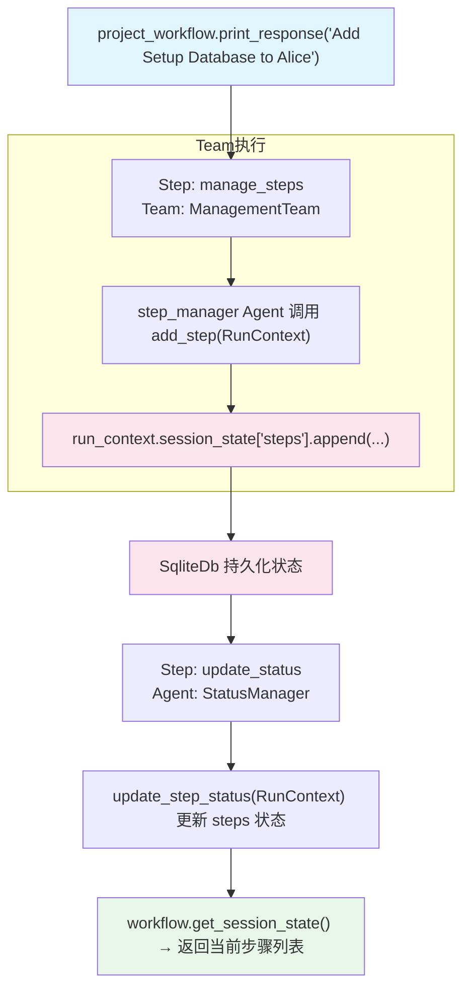

# state_with_team.py — 实现原理分析

> 源文件：`cookbook/04_workflows/06_advanced_concepts/session_state/state_with_team.py`

## 概述

本示例展示 Agno Workflow **`session_state` 通过 Team 工具共享**机制：Team 及其 Agent 成员的工具函数通过 `RunContext.session_state` 访问 Workflow 的会话状态，实现项目步骤的增删改查（CRUD）跨 run 持久化。

**核心配置一览：**

| 配置项 | 值 | 说明 |
|--------|------|------|
| Team 工具 | `add_step`, `delete_step` | 操作 session_state["steps"] |
| Agent 工具 | `update_step_status`, `assign_step` | 更新步骤状态/归属 |
| 状态初始化 | `session_state={"steps": []}` | 步骤列表容器 |
| `workflow.get_session_state()` | 返回当前完整状态 | 外部读取状态快照 |

## 核心组件解析

### Team 级工具（管理团队执行）

```python
def add_step(run_context: RunContext, step_name: str, assignee: str, priority: str = "medium") -> str:
    run_context.session_state.setdefault("steps", []).append({
        "name": step_name, "assignee": assignee, "status": "pending", "priority": priority,
    })
    return f"Added '{step_name}'. Total: {len(run_context.session_state['steps'])}"

def delete_step(run_context: RunContext, step_name: str) -> str:
    steps = run_context.session_state.get("steps", [])
    # 遍历删除匹配的步骤
```

### Agent 级工具（状态管理）

```python
def update_step_status(run_context: RunContext, step_name: str, new_status: str, notes: str = "") -> str:
    for step in run_context.session_state.get("steps", []):
        if step["name"] == step_name:
            step["status"] = new_status
            return f"Updated '{step_name}' to '{new_status}'"
```

### Team + Agent 两层架构

```python
management_team = Team(
    tools=[add_step, delete_step],   # Team 持有增删工具
    members=[step_manager, step_coordinator],
)

status_manager = Agent(
    tools=[update_step_status, assign_step],  # Agent 持有状态更新工具
)

project_workflow = Workflow(
    steps=[
        Step(name="manage_steps", team=management_team),      # 第一步：增删
        Step(name="update_status", agent=status_manager),     # 第二步：状态更新
    ],
    session_state={"steps": []},
)
```

## 状态读取接口

```python
# 获取完整 session_state 快照
session_state = project_workflow.get_session_state()
steps = session_state.get("steps", [])
```

## Mermaid 流程图



## 关键源码文件索引

| 文件 | 关键类/函数 | 作用 |
|------|------------|------|
| `agno/run/context.py` | `RunContext.session_state` | 工具函数访问 Workflow 状态 |
| `agno/workflow/workflow.py` | `Workflow.get_session_state()` | 外部查询当前状态快照 |
| `agno/team/team.py` | `Team.tools` | 团队级工具，绑定 RunContext |
