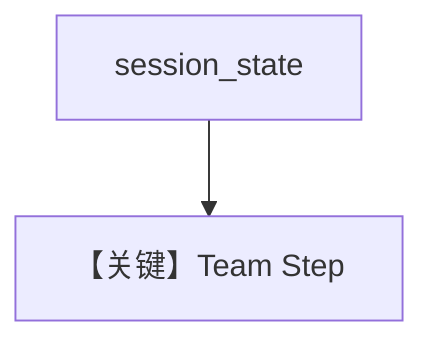

# state_with_team.py — 实现原理分析

> 源文件：`cookbook/04_workflows/06_advanced_concepts/session_state/state_with_team.py`

## 概述

本示例展示 **Team Step** 与 **session_state** 同用：多成员共享 RunContext 中的会话状态，用于协作任务中的共享黑板变量。

## Mermaid 流程图

```mermaid
flowchart TD
    SS["session_state"] --> T["【关键】Team Step"]
```

## 关键源码文件索引

| 文件 | 作用 |
|------|------|
| `agno/team/team.py` | Team 与上下文 |
