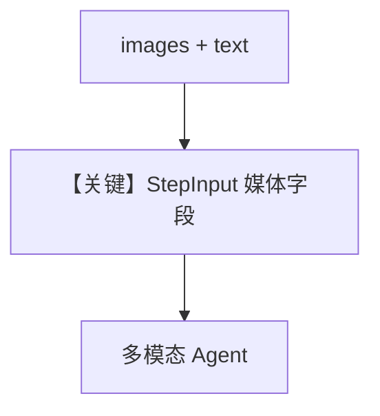

# image_input.py — 实现原理分析

<!-- cookbook-py-source:start -->
## 完整源码

```python
"""
Image Input
===========

Demonstrates passing image media into workflow runs and chaining analysis with follow-up research.
"""

from agno.agent import Agent
from agno.db.sqlite import SqliteDb
from agno.media import Image
from agno.models.openai import OpenAIChat
from agno.tools.websearch import WebSearchTools
from agno.workflow.step import Step
from agno.workflow.workflow import Workflow

# ---------------------------------------------------------------------------
# Create Agents
# ---------------------------------------------------------------------------
image_analyzer = Agent(
    name="Image Analyzer",
    model=OpenAIChat(id="gpt-4o"),
    instructions="Analyze the provided image and extract key details, objects, and context.",
)

news_researcher = Agent(
    name="News Researcher",
    model=OpenAIChat(id="gpt-4o"),
    tools=[WebSearchTools()],
    instructions="Search for latest news and information related to the analyzed image content.",
)

# ---------------------------------------------------------------------------
# Define Steps
# ---------------------------------------------------------------------------
analysis_step = Step(
    name="Image Analysis Step",
    agent=image_analyzer,
)

research_step = Step(
    name="News Research Step",
    agent=news_researcher,
)

# ---------------------------------------------------------------------------
# Create Workflow
# ---------------------------------------------------------------------------
media_workflow = Workflow(
    name="Image Analysis and Research Workflow",
    description="Analyze an image and research related news",
    steps=[analysis_step, research_step],
    db=SqliteDb(session_table="workflow_session", db_file="tmp/workflow.db"),
)

# ---------------------------------------------------------------------------
# Run Workflow
# ---------------------------------------------------------------------------
if __name__ == "__main__":
    media_workflow.print_response(
        input="Please analyze this image and find related news",
        images=[
            Image(
                url="https://upload.wikimedia.org/wikipedia/commons/0/0c/GoldenGateBridge-001.jpg"
            )
        ],
        markdown=True,
    )
```

<!-- cookbook-py-source:end -->

> 源文件：`cookbook/04_workflows/06_advanced_concepts/structured_io/image_input.py`

## 概述

本示例展示 **`Workflow.run(..., images=[Image(...)]）`**（或 `print_response` 等价参数）：将图像媒体传入工作流，后续 Step 可做多模态理解并衔接 Web 研究等步骤。

**核心配置一览：**

| 配置项 | 说明 |
|--------|------|
| `images` | `List[Image]` |
| `db` | `SqliteDb` |
| Agent | 视觉+搜索能力组合 |

## 运行机制与因果链

媒体与文本一并进入 `StepInput`，在 Agent 调用链中映射为提供商所需消息格式（见 `agno/media` 与各 Model）。

## System Prompt 组装

视觉 Agent instructions 见源文件；多模态消息占 user 内容或专用段。

## Mermaid 流程图



## 关键源码文件索引

| 文件 | 作用 |
|------|------|
| `agno/workflow/workflow.py` | `images` run 参数 |
| `agno/media` | `Image` |
