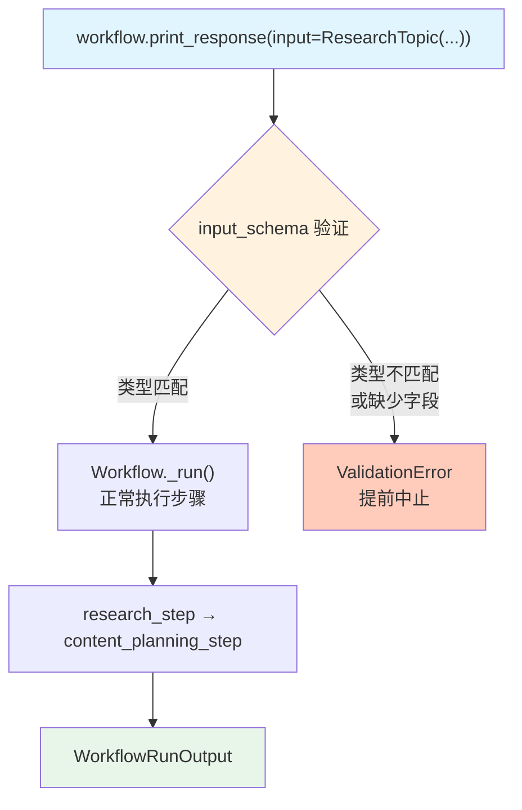

# input_schema.py — 实现原理分析

> 源文件：`cookbook/04_workflows/06_advanced_concepts/structured_io/input_schema.py`

## 概述

本示例展示 Agno Workflow **`input_schema` 输入验证**机制：`Workflow(input_schema=MyModel)` 配置后，Workflow 在运行时校验传入的 `input` 是否符合指定的 Pydantic 模型类型，不合规的输入将在运行前抛出验证错误。

**核心配置一览：**

| 配置项 | 值 | 说明 |
|--------|------|------|
| `Workflow.input_schema` | `ResearchTopic`（Pydantic 类） | 输入类型约束 |
| 合法输入 | `ResearchTopic(...)` 实例或匹配字典 | 通过验证 |
| 非法输入 | `DifferentModel(...)` 或缺少必填字段 | 抛出验证错误 |

## 核心组件解析

### 声明 input_schema

```python
class ResearchTopic(BaseModel):
    topic: str
    focus_areas: List[str] = Field(description="Specific areas to focus on")
    target_audience: str = Field(description="Who this research is for")
    sources_required: int = Field(description="Number of sources needed", default=5)

content_creation_workflow = Workflow(
    steps=[research_step, content_planning_step],
    input_schema=ResearchTopic,    # 绑定输入 Schema
)
```

### 合法输入

```python
# 传入完整的 ResearchTopic 实例 → 通过验证
content_creation_workflow.print_response(
    input=ResearchTopic(
        topic="AI trends",
        focus_areas=["ML", "NLP"],
        target_audience="Tech professionals",
    ),
)

# 传入匹配的字典 → 也通过验证
content_creation_workflow.print_response(
    input={"topic": "AI", "focus_areas": ["ML"], "target_audience": "Professionals"},
)
```

### 非法输入（注释中的示例）

```python
# 缺少必填字段 → 验证失败
content_creation_workflow.print_response(
    input=ResearchTopic(topic="AI", focus_areas=["ML"]),  # 缺少 target_audience
)

# 传入不匹配的模型类型 → 验证失败
content_creation_workflow.print_response(
    input=DifferentModel(name="test"),  # 类型不匹配
)
```

## input_schema vs pydantic_input 对比

| 特性 | `pydantic_input.py` | `input_schema.py` |
|------|-------------------|------------------|
| 功能 | 仅支持 Pydantic 实例输入 | 强制验证输入类型 |
| 配置 | 无需额外配置 | `Workflow(input_schema=Model)` |
| 验证 | 无验证（任意类型） | 严格类型验证 |
| 错误 | 无验证错误 | 不匹配时提前报错 |

## Mermaid 流程图



## 关键源码文件索引

| 文件 | 关键类/函数 | 作用 |
|------|------------|------|
| `agno/workflow/workflow.py` | `Workflow.input_schema` | 输入类型约束配置 |
| `agno/workflow/workflow.py` | `Workflow._run()` | 运行前验证输入类型 |
