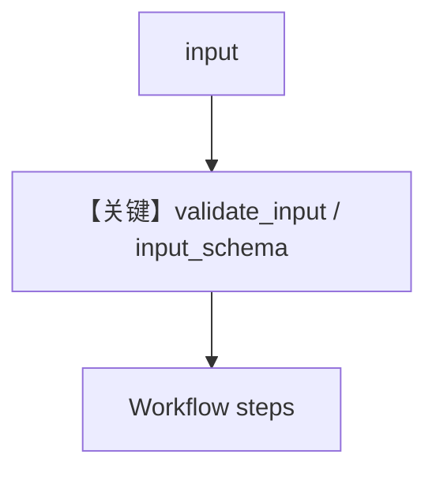

# input_schema.py — 实现原理分析

> 源文件：`cookbook/04_workflows/06_advanced_concepts/structured_io/input_schema.py`

## 概述

本示例展示 **`Workflow.input_schema: Type[BaseModel]`** 与 `validate_input`：合法输入被校验为 `ResearchTopic` 等模型；错误类型（如 `DifferentModel`）触发校验失败。用于强制工作流入口为结构化 JSON/对象。

**核心配置一览：**

| 配置项 | 说明 |
|--------|------|
| `ResearchTopic` | `topic`, `focus_areas`, `target_audience`, `sources_required` |
| `Workflow(..., input_schema=ResearchTopic)` | 见文件 `Workflow` 定义段 |
| `Team` + `Step` | 研究管线 |

## 核心组件解析

`Workflow.run` 在传入 `input` 且存在 `input_schema` 时调用校验（`workflow.py` `L6441-6444` 一带）。

### 运行机制与因果链

校验失败抛错不进入步骤；成功则 `input` 可为 dict/BaseModel 转交下游。

## System Prompt 组装

子 Agent 使用 `role`/`instructions`（`L38+`）；入口无单独 LLM system。

## 完整 API 请求

研究步：`OpenAIChat` Chat Completions + tools。

## Mermaid 流程图

```mermaid
flowchart TD
    I["input"] --> V["【关键】validate_input / input_schema"]
    V --> W["Workflow steps"]
```

## 关键源码文件索引

| 文件 | 作用 |
|------|------|
| `agno/utils/agent.py` | `validate_input` |
| `agno/workflow/workflow.py` | `input_schema` L257-258 |
