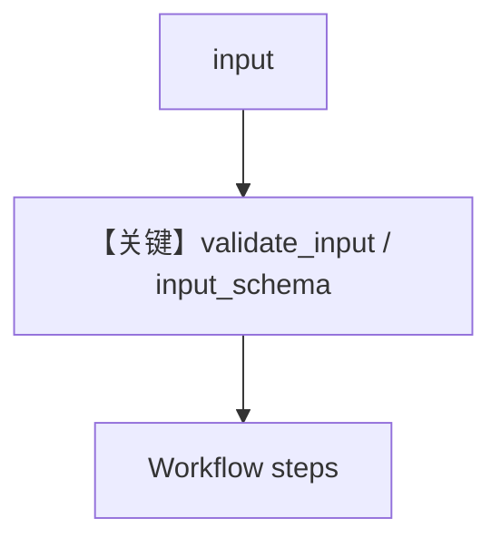

# input_schema.py — 实现原理分析

<!-- cookbook-py-source:start -->
## 完整源码

```python
"""
Input Schema
============

Demonstrates workflow-level `input_schema` validation with structured and invalid input examples.
"""

from typing import List

from agno.agent import Agent
from agno.db.sqlite import SqliteDb
from agno.models.openai import OpenAIChat
from agno.team import Team
from agno.tools.hackernews import HackerNewsTools
from agno.tools.websearch import WebSearchTools
from agno.workflow.step import Step
from agno.workflow.workflow import Workflow
from pydantic import BaseModel, Field


# ---------------------------------------------------------------------------
# Define Input Models
# ---------------------------------------------------------------------------
class DifferentModel(BaseModel):
    name: str


class ResearchTopic(BaseModel):
    topic: str
    focus_areas: List[str] = Field(description="Specific areas to focus on")
    target_audience: str = Field(description="Who this research is for")
    sources_required: int = Field(description="Number of sources needed", default=5)


# ---------------------------------------------------------------------------
# Create Agents
# ---------------------------------------------------------------------------
hackernews_agent = Agent(
    name="Hackernews Agent",
    model=OpenAIChat(id="gpt-4o-mini"),
    tools=[HackerNewsTools()],
    role="Extract key insights and content from Hackernews posts",
)

web_agent = Agent(
    name="Web Agent",
    model=OpenAIChat(id="gpt-4o-mini"),
    tools=[WebSearchTools()],
    role="Search the web for the latest news and trends",
)

content_planner = Agent(
    name="Content Planner",
    model=OpenAIChat(id="gpt-4o"),
    instructions=[
        "Plan a content schedule over 4 weeks for the provided topic and research content",
        "Ensure that I have posts for 3 posts per week",
    ],
)

# ---------------------------------------------------------------------------
# Create Team
# ---------------------------------------------------------------------------
research_team = Team(
    name="Research Team",
    members=[hackernews_agent, web_agent],
    instructions="Research tech topics from Hackernews and the web",
)

# ---------------------------------------------------------------------------
# Define Steps
# ---------------------------------------------------------------------------
research_step = Step(
    name="Research Step",
    team=research_team,
)

content_planning_step = Step(
    name="Content Planning Step",
    agent=content_planner,
)

# ---------------------------------------------------------------------------
# Create Workflow
# ---------------------------------------------------------------------------
content_creation_workflow = Workflow(
    name="Content Creation Workflow",
    description="Automated content creation from blog posts to social media",
    db=SqliteDb(
        session_table="workflow_session",
        db_file="tmp/workflow.db",
    ),
    steps=[research_step, content_planning_step],
    input_schema=ResearchTopic,
)

# ---------------------------------------------------------------------------
# Run Workflow
# ---------------------------------------------------------------------------
if __name__ == "__main__":
    print("=== Example: Research with Structured Topic ===")
    research_topic = ResearchTopic(
        topic="AI trends in 2024",
        focus_areas=[
            "Machine Learning",
            "Natural Language Processing",
            "Computer Vision",
            "AI Ethics",
        ],
        target_audience="Tech professionals and business leaders",
    )

    content_creation_workflow.print_response(
        input=research_topic,
        markdown=True,
    )

    # Should fail, as some fields present in input schema are missing.
    # content_creation_workflow.print_response(
    #     input=ResearchTopic(
    #         topic="AI trends in 2024",
    #         focus_areas=[
    #             "Machine Learning",
    #             "Natural Language Processing",
    #             "Computer Vision",
    #             "AI Ethics",
    #         ],
    #     ),
    #     markdown=True,
    # )

    # Should fail, as it is not in sync with input schema.
    # content_creation_workflow.print_response(
    #     input=DifferentModel(name="test"),
    #     markdown=True,
    # )

    # Pass a valid dict that matches ResearchTopic.
    # content_creation_workflow.print_response(
    #     input={
    #         "topic": "AI trends in 2024",
    #         "focus_areas": ["Machine Learning", "Computer Vision"],
    #         "target_audience": "Tech professionals",
    #         "sources_required": 8,
    #     },
    #     markdown=True,
    # )
```

<!-- cookbook-py-source:end -->

> 源文件：`cookbook/04_workflows/06_advanced_concepts/structured_io/input_schema.py`

## 概述

本示例展示 **`Workflow.input_schema: Type[BaseModel]`** 与 `validate_input`：合法输入被校验为 `ResearchTopic` 等模型；错误类型（如 `DifferentModel`）触发校验失败。用于强制工作流入口为结构化 JSON/对象。

**核心配置一览：**

| 配置项 | 说明 |
|--------|------|
| `ResearchTopic` | `topic`, `focus_areas`, `target_audience`, `sources_required` |
| `Workflow(..., input_schema=ResearchTopic)` | 见文件 `Workflow` 定义段 |
| `Team` + `Step` | 研究管线 |

## 核心组件解析

`Workflow.run` 在传入 `input` 且存在 `input_schema` 时调用校验（`workflow.py` `L6441-6444` 一带）。

### 运行机制与因果链

校验失败抛错不进入步骤；成功则 `input` 可为 dict/BaseModel 转交下游。

## System Prompt 组装

子 Agent 使用 `role`/`instructions`（`L38+`）；入口无单独 LLM system。

## 完整 API 请求

研究步：`OpenAIChat` Chat Completions + tools。

## Mermaid 流程图


```mermaid
flowchart TD
    I["input"] --> V["【关键】validate_input / input_schema"]
    V --> W["Workflow steps"]
```

## 关键源码文件索引

| 文件 | 作用 |
|------|------|
| `agno/utils/agent.py` | `validate_input` |
| `agno/workflow/workflow.py` | `input_schema` L257-258 |
