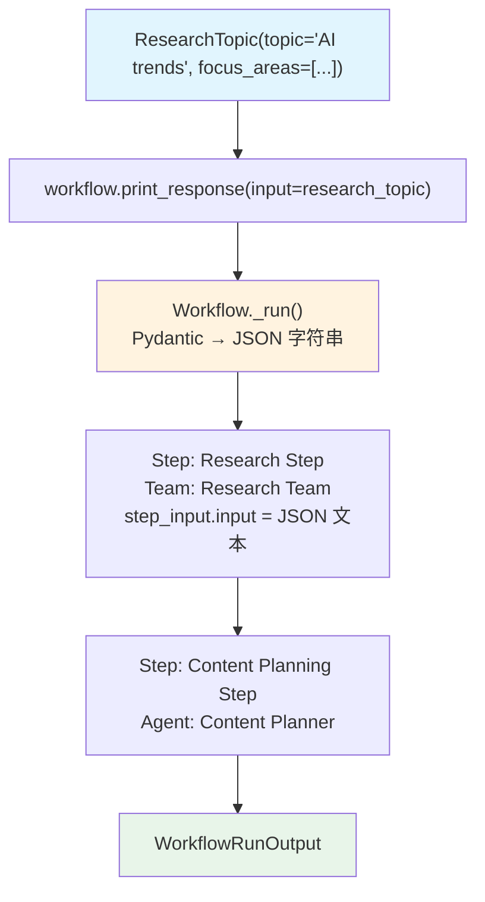

# pydantic_input.py — 实现原理分析

> 源文件：`cookbook/04_workflows/06_advanced_concepts/structured_io/pydantic_input.py`

## 概述

本示例展示 Agno Workflow **直接接受 Pydantic 模型实例作为 `input`**：`workflow.print_response(input=pydantic_instance)` 传入 Pydantic 对象时，Workflow 自动将其序列化为文本传递给步骤，无需手动 `model.model_dump_json()`。

**核心配置一览：**

| 配置项 | 值 | 说明 |
|--------|------|------|
| `input` 类型 | `Pydantic BaseModel 实例` | 自动序列化 |
| 传递路径 | `step_input.input` | Agent 步骤接收文本化结果 |
| 无需额外配置 | `Workflow` 自动处理 | Workflow 内置转换 |

## 核心组件解析

### Pydantic 输入模型定义

```python
class ResearchTopic(BaseModel):
    topic: str
    focus_areas: List[str] = Field(description="Specific areas to focus on")
    target_audience: str = Field(description="Who this research is for")
    sources_required: int = Field(description="Number of sources needed", default=5)
```

### 传入 Pydantic 实例

```python
research_topic = ResearchTopic(
    topic="AI trends in 2024",
    focus_areas=["Machine Learning", "NLP", "Computer Vision", "AI Ethics"],
    target_audience="Tech professionals and business leaders",
    sources_required=8,
)

content_creation_workflow.print_response(
    input=research_topic,   # 直接传入 Pydantic 实例
    markdown=True,
)
```

### Workflow 内部处理

Workflow 在 `_run()` 开始时将 Pydantic 实例转换为 JSON 字符串，步骤通过 `step_input.input` 接收结构化的文本描述，Agent 可直接理解 JSON 格式的字段含义。

## 对比方式

| 方式 | 代码 | 说明 |
|------|------|------|
| 字符串输入 | `workflow.run(input="AI trends")` | 最简单 |
| Pydantic 实例 | `workflow.run(input=ResearchTopic(...))` | 结构化，自动序列化 |
| 字典输入 | `workflow.run(input={"topic": "AI", ...})` | 等价于 Pydantic |

## Mermaid 流程图



## 关键源码文件索引

| 文件 | 关键类/函数 | 作用 |
|------|------------|------|
| `agno/workflow/workflow.py` | `Workflow._run()` | Pydantic 实例序列化处理 |
| `agno/workflow/types.py` | `StepInput.input` | 步骤接收的输入字段 |
