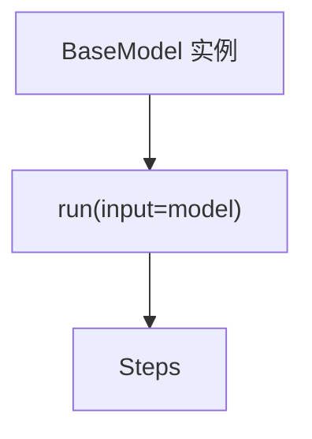

# pydantic_input.py — 实现原理分析

<!-- cookbook-py-source:start -->
## 完整源码

```python
"""
Pydantic Input
==============

Demonstrates passing a Pydantic model instance directly as workflow input.
"""

from typing import List

from agno.agent import Agent
from agno.db.sqlite import SqliteDb
from agno.models.openai import OpenAIChat
from agno.team import Team
from agno.tools.hackernews import HackerNewsTools
from agno.tools.websearch import WebSearchTools
from agno.workflow.step import Step
from agno.workflow.workflow import Workflow
from pydantic import BaseModel, Field


# ---------------------------------------------------------------------------
# Define Input Model
# ---------------------------------------------------------------------------
class ResearchTopic(BaseModel):
    topic: str
    focus_areas: List[str] = Field(description="Specific areas to focus on")
    target_audience: str = Field(description="Who this research is for")
    sources_required: int = Field(description="Number of sources needed", default=5)


# ---------------------------------------------------------------------------
# Create Agents
# ---------------------------------------------------------------------------
hackernews_agent = Agent(
    name="Hackernews Agent",
    model=OpenAIChat(id="gpt-4o-mini"),
    tools=[HackerNewsTools()],
    role="Extract key insights and content from Hackernews posts",
)

web_agent = Agent(
    name="Web Agent",
    model=OpenAIChat(id="gpt-4o-mini"),
    tools=[WebSearchTools()],
    role="Search the web for the latest news and trends",
)

content_planner = Agent(
    name="Content Planner",
    model=OpenAIChat(id="gpt-4o"),
    instructions=[
        "Plan a content schedule over 4 weeks for the provided topic and research content",
        "Ensure that I have posts for 3 posts per week",
    ],
)

# ---------------------------------------------------------------------------
# Create Team
# ---------------------------------------------------------------------------
research_team = Team(
    name="Research Team",
    members=[hackernews_agent, web_agent],
    instructions="Research tech topics from Hackernews and the web",
)

# ---------------------------------------------------------------------------
# Define Steps
# ---------------------------------------------------------------------------
research_step = Step(
    name="Research Step",
    team=research_team,
)

content_planning_step = Step(
    name="Content Planning Step",
    agent=content_planner,
)

# ---------------------------------------------------------------------------
# Create Workflow
# ---------------------------------------------------------------------------
content_creation_workflow = Workflow(
    name="Content Creation Workflow",
    description="Automated content creation from blog posts to social media",
    db=SqliteDb(
        session_table="workflow_session",
        db_file="tmp/workflow.db",
    ),
    steps=[research_step, content_planning_step],
)

# ---------------------------------------------------------------------------
# Run Workflow
# ---------------------------------------------------------------------------
if __name__ == "__main__":
    print("=== Example: Research with Structured Topic ===")
    research_topic = ResearchTopic(
        topic="AI trends in 2024",
        focus_areas=[
            "Machine Learning",
            "Natural Language Processing",
            "Computer Vision",
            "AI Ethics",
        ],
        target_audience="Tech professionals and business leaders",
        sources_required=8,
    )
    content_creation_workflow.print_response(
        input=research_topic,
        markdown=True,
    )
```

<!-- cookbook-py-source:end -->

> 源文件：`cookbook/04_workflows/06_advanced_concepts/structured_io/pydantic_input.py`

## 概述

本示例展示 **将 Pydantic 模型实例直接作为 `input`**：`Workflow` 将其序列化/校验后传入各步，比裸 `dict` 更利于 IDE 与运行时约束。

**核心配置一览：**

| 配置项 | 说明 |
|--------|------|
| 自定义 `BaseModel` | 字段见源文件 |
| `Team`/`Step` | 下游消费结构化主题 |

## 运行机制与因果链

与 `input_schema` 不同：此处强调**传入已是模型实例**的 happy path；`input_schema` 强调校验失败路径。

## Mermaid 流程图


```mermaid
flowchart TD
    M["BaseModel 实例"] --> R["run(input=model)"]
    R --> T["Steps"]
```

## 关键源码文件索引

| 文件 | 作用 |
|------|------|
| `agno/workflow/workflow.py` | `input` 类型处理 |
