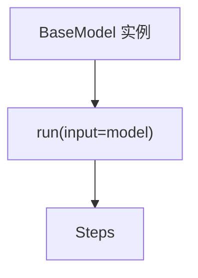

# pydantic_input.py — 实现原理分析

> 源文件：`cookbook/04_workflows/06_advanced_concepts/structured_io/pydantic_input.py`

## 概述

本示例展示 **将 Pydantic 模型实例直接作为 `input`**：`Workflow` 将其序列化/校验后传入各步，比裸 `dict` 更利于 IDE 与运行时约束。

**核心配置一览：**

| 配置项 | 说明 |
|--------|------|
| 自定义 `BaseModel` | 字段见源文件 |
| `Team`/`Step` | 下游消费结构化主题 |

## 运行机制与因果链

与 `input_schema` 不同：此处强调**传入已是模型实例**的 happy path；`input_schema` 强调校验失败路径。

## Mermaid 流程图

```mermaid
flowchart TD
    M["BaseModel 实例"] --> R["run(input=model)"]
    R --> T["Steps"]
```

## 关键源码文件索引

| 文件 | 作用 |
|------|------|
| `agno/workflow/workflow.py` | `input` 类型处理 |
