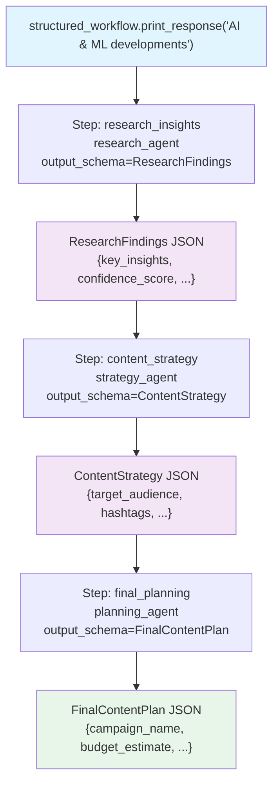

# structured_io_agent.py — 实现原理分析

> 源文件：`cookbook/04_workflows/06_advanced_concepts/structured_io/structured_io_agent.py`

## 概述

本示例展示 Agno Workflow **每个步骤使用独立 `output_schema` 的结构化数据流**：三个 Agent 步骤各自声明 Pydantic `output_schema`，每步的结构化输出（JSON）作为下一步的输入，实现端到端类型安全的数据流水线（研究 → 策略 → 计划）。

**核心配置一览：**

| 步骤 | output_schema | 说明 |
|------|-------------|------|
| research_step | `ResearchFindings` | 研究洞察、可信度分数 |
| strategy_step | `ContentStrategy` | 内容策略、目标受众 |
| planning_step | `FinalContentPlan` | 完整内容日历、预算 |

## 核心组件解析

### 每步 Agent 声明 output_schema

```python
research_agent = Agent(
    name="AI Research Specialist",
    tools=[HackerNewsTools(), WebSearchTools()],
    output_schema=ResearchFindings,   # 结构化输出
)

strategy_agent = Agent(
    name="Content Strategy Expert",
    output_schema=ContentStrategy,
)

planning_agent = Agent(
    name="Content Planning Specialist",
    output_schema=FinalContentPlan,
)
```

### Pydantic 模型定义

```python
class ResearchFindings(BaseModel):
    topic: str
    key_insights: List[str] = Field(min_items=3)
    trending_technologies: List[str] = Field(min_items=2)
    market_impact: str
    sources_count: int
    confidence_score: float = Field(ge=0.0, le=1.0)

class ContentStrategy(BaseModel):
    target_audience: str
    content_pillars: List[str] = Field(min_items=3)
    posting_schedule: List[str]
    key_messages: List[str] = Field(min_items=3)
    hashtags: List[str] = Field(min_items=5)
    engagement_tactics: List[str] = Field(min_items=2)

class FinalContentPlan(BaseModel):
    campaign_name: str
    content_calendar: List[str] = Field(min_items=6)
    success_metrics: List[str] = Field(min_items=3)
    budget_estimate: str
    timeline: str
    risk_factors: List[str] = Field(min_items=2)
```

### 结构化数据流

```
step_1 输出: ResearchFindings(topic="AI", key_insights=[...], confidence_score=0.9)
    ↓ 序列化为 JSON → step_input.previous_step_content
step_2 输入: JSON 字符串（strategy_agent 解析 ResearchFindings）
step_2 输出: ContentStrategy(target_audience="developers", content_pillars=[...])
    ↓
step_3 输入: JSON 字符串（planning_agent 解析 ContentStrategy）
step_3 输出: FinalContentPlan(campaign_name="AI Q1", content_calendar=[...])
```

## Mermaid 流程图



## 关键源码文件索引

| 文件 | 关键类/函数 | 作用 |
|------|------------|------|
| `agno/agent/agent.py` | `Agent.output_schema` | 强制结构化 JSON 输出 |
| `agno/workflow/types.py` | `StepInput.previous_step_content` | 传递前步 JSON 输出 |
